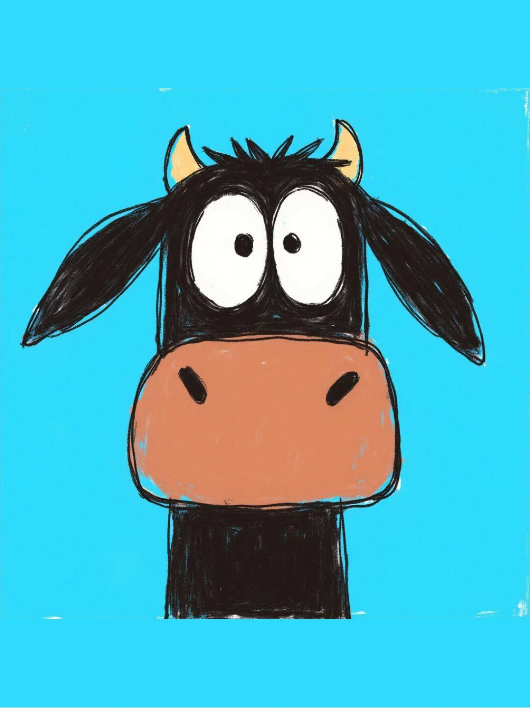

<!--
  这是「关于」页的内容，直接用 Markdown 书写，改完保存即可生效。
  换头像：把你自己的照片放进 assets/ 目录，命名为 avatar.jpg，
  然后把下面  标签里的 assets/avatar.svg 改成 assets/avatar.jpg。
-->
<!-- 

 -->

你好，我是 **provable0816**。（这是一段占位简介 —— 把它换成你自己的故事：你是谁、在做什么、对什么着迷。）

我喜欢那些可以**被证明**的东西：代码、公式、以及「这件事值得做」的理由。白天写工程，晚上推公式，把值得记录的东西留在这里。

## 正在做的事

- 研究 / 工作方向：**（在这里填你的方向）**
- 长期项目：这个博客本身 —— 记录学习与思考
- 近期计划：读几本好书，写几篇像样的文章

## 技能与工具

| 类别 | 内容 |
| --- | --- |
| 语言 | Python · JavaScript · C++（按实际情况修改） |
| 领域 | 人工智能 · 智能显示系统 · 智能工具系统 |
| 工具 | Git · Linux · VS Code |

## 找到我

- GitHub：[provable0816](https://github.com/provable0816)
- 邮箱：745134809 {AT} qq {dot} com （改成你自己的）
- 其他链接：知乎 / 掘金 / Twitter……（自行增删）

---

最后更新：2026-09
