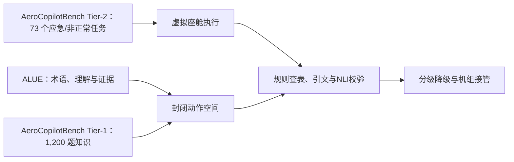

# 大模型可控生成与航空安全关键应用：研究方向与论文综述

> **报告定位**：面向"给大模型一本飞行员手册，让它根据飞机状态推理生成当前操作指令"这一安全关键任务，系统梳理 17 个可深入研究的开放方向，每个方向配可核验的代表性论文、技术方法与数据。
>
> **阅读方式**：每个方向统一按 `研究方向 → 研究点（含为什么是开放问题）→ 相关论文 → 开放问题与选题建议` 四段组织。论文条目包含标题原名、中译名、作者/机构、年份与出处、核心方法、关键结论与数据、与本方向的关联、局限。

---

## 一、如何使用这份报告

1. **按编号对照**：方向 1–5 → 第一部分；6–8 → 第二部分上半；9–11 → 第二部分下半；12–14 → 第四部分；15–17 → 第五部分；航空专属内容 → 第六部分。
2. **按目标跳读**：见文末「选题建议矩阵」。
3. **看存疑标注**：各方向末尾的「存疑/待核实条目」小节列出了未能完全核实来源的线索。**这些未经验证的条目请不要直接引用**，需自行核验原文后再用。

## 二、真实性声明

本报告遵循"真实性优先于完整性"原则：

- 只收录能核实到出处（arXiv 编号 / 会议期刊 / 法规文件编号）的条目；
- 所有数字均标注为论文自报结果或机构发布数据，未做独立复现；
- 无法确认标题、编号、作者或数字的条目，一律单列在「存疑/待核实条目」并说明存疑原因，不混入正文；
- 若某方向确认不存在直接相关的已发表工作，明确写出并给出最接近的起点，而**不把通用领域论文硬套成航空场景论文**。

需要特别说明的是：本报告中大量条目来自 2025–2026 年的预印本（arXiv），尚未经过同行评议，其结论与数字应视为阶段性结果。

## 三、方向全景图

| 编号 | 方向 | 所属部分 | 一句话定位 | 成熟度 |
|---|---|---|---|---|
| 1 | 约束解码的分布失真 | 一 | 局部掩码会沿轨迹累积偏差，把生成推向"易合法但语义错误" | 活跃，有初步工作 |
| 2 | 约束器 soundness / completeness 对齐 | 一 | 约束器不完备反而损害正确性，且几乎无人研究 | 刚起步 |
| 3 | 精确约束推理的计算复杂性 | 一 | 带最优性保证的约束生成一般不可行，须刻画可解边界 | 有理论结果，工程界忽视 |
| 4 | 局部掩码 → 全局约束解码 | 一 | 用 SMC / 张量化 FSM 逼近真实约束后验 | 活跃，偏理论 |
| 5 | 约束解码自身作为攻击面 | 一 | grammar 属于"控制面"，可被利用形成越狱 | 全新（2026） |
| 6 | 手册 → 可执行状态机编译 | 二 | 整条链路的地基，问题在于抽取错误如何传播 | 工程成熟，学术空白 |
| 7 | 引文忠实度瓶颈在生成侧 | 二 | 给对原文也不改忠实度，模型会"事后合理化引用" | 活跃，有反直觉发现 |
| 8 | 程序性蕴含 | 二 | 判定"动作序列是否为手册程序的合法实例化" | **几乎空白** |
| 9 | knowing–doing gap | 二 | 有知识 ≠ 能安全执行，最关键是"错误语义先验" | 有强实证锚点 |
| 10 | 状态表示设计的系统消融 | 二 | granularity × structure × modality 的扫描 | 有初步结论，反转假设待验 |
| 11 | 长程记忆与漂移早期检测 | 二 | 外置状态追踪 vs 上下文累积，漂移在线预警 | 中等 |
| 12 | 神经符号运行时护盾 | 四 | 符号层在运行时拦截不安全输出 | 成果丰富，航空侧空白 |
| 13 | 弃权与分级降级 | 四 | 驾驶舱里"不知道"的正确形态是降级而非沉默 | 有 CP 工具，鸿沟未解 |
| 14 | 运行时鲁棒性监控 | 四 | 统计式运行时验证作为形式化的可扩展替代 | 中等 |
| 15 | 覆盖度论据与 ODD 定义 | 五 | 输入空间不可枚举 vs 认证要求"未测也安全" | 标准制定中 |
| 16 | 对抗性故障注入与覆盖驱动测试生成 | 五 | 自动生成"最可能骗过系统"的状态组合 | 中等 |
| 17 | 基准缺口 | 五 | 多故障并发、手册版本漂移、人在回路评测协议缺失 | 缺口明确 |

## 四、三条主线与它们的依赖关系

```
主线 A：生成侧可控性（方向 1–5）
  ├─ 回答：给定封闭动作空间，如何生成既合法又语义正确的输出？
  └─ 结论要点：硬掩码不是正确性证明；约束器本身的健全性决定保证的真实边界；
              精确最优一般不可行；控制面本身是攻击面。

主线 B：知识与接地（方向 6–11）
  ├─ 回答：手册知识如何变成可执行的程序？模型如何真正"看着状态"做决策？
  └─ 结论要点：抽取错误的传播是空白；忠实度瓶颈在生成侧而非检索侧；
              知识掌握与执行安全相关性仅约 0.57。

主线 C：验证与认证（方向 12–17）
  ├─ 回答：如何证明（而非希望）系统是安全的？
  └─ 结论要点：shield 需最小化干预；统计保证与航空安全预算之间存在数量级鸿沟；
              ODD 与覆盖度论据尚无成熟方法。
```

三条主线不是并列的：**C 决定这个系统能不能上飞机，A 和 B 决定它好不好用**。在当前认证现实下（见 6.4 节），C 的研究价值被严重低估——大量工作堆在 A 和 B 上，而真正的瓶颈在 C。

## 五、一个贯穿全报告的判断标准

判断某个研究点是否扎实，可以用一个问题检验：

> **你的方法能不能给出一个"在什么条件下会失效"的明确刻画？**

答不上来的，多半只是工程优化而非研究贡献。这个标准在方向 2（约束器对齐）、方向 8（程序性蕴含）、方向 13（分级降级）、方向 15（ODD 与覆盖度）上尤其好用——这几个方向的共同点是，它们要求的不是"更好的平均分"，而是"可陈述的失效边界"。

## 六、选题建议矩阵

| 你的目标 | 优先方向 | 理由 |
|---|---|---|
| **快速出论文（12–18 个月）** | 9、10、8、5 | 有强实证锚点或明确空白；实验可设计，不需要真机数据 |
| **做能落地的真系统** | 2、6、12、13 | 直接对应工程痛点：约束器对齐检测、手册编译、最小化干预 shield、分级降级 |
| **赌长期影响力** | 3、15 | 复杂性理论刻画可解边界；ODD 与覆盖度论据可能影响标准制定 |
| **想做航空专属贡献** | 见 6.5 节 | 通用结论在航空场景下会反转的方向 |

---

## 第一部分：约束解码的理论与算法（方向 1–5）

## 前置说明：硬掩码只是闭环控制的入口，而非正确性证明

在航空安全关键场景中，推荐将大模型（LLM）的输出设计为**封闭动作空间中的结构化动作对象**，例如：

```json
{"op":"SET","target":"THR_LEVER_1","value":"IDLE"}
```

生成系统再通过 logits 硬掩码（hard masking），只允许能够延续为合法动作序列的 token。这里的“合法”首先指 token 序列能够完成形式语言中的有效推导，而不是直接指动作在飞机当前状态下可以被安全执行。

形式合法与运行安全之间不能画等号。如果动作 schema 允许 `SET THR_LEVER_1 = IDLE`，语法层就无法拒绝该动作；该动作是否适用于当前构型、高度、速度和告警状态，必须由外部动力学模型、飞行动力学与状态估计、QRH/手册规则以及独立监控器判定。因此，约束解码在整个安全架构中的正确位置是：**将模型从自由文本生成器降级为受限动作选择器，再把形式合法候选交付给不信任模型的独立验证层。**

基于这一边界，本部分只讨论约束解码的理论性质与算法机制，不覆盖独立验证器、控制律、机载部署认证或完整系统架构。下文将形式约束记为 \(C\)，自回归模型在上下文 \(h_t\) 下的原始 next-token 分布记为 \(p_\theta(\cdot\mid h_t)\)，约束可接受的 token 集合记为 \(\mathcal A(h_t)\)。逐 token 硬掩码通常定义 \(q(x_t\mid h_t)\propto p_\theta(x_t\mid h_t)\mathbf 1[x_t\in\mathcal A(h_t)]\)，随后在剩余候选上重新归一化。

这一“掩码—重归一化”操作是五个方向的共同起点。它可以在每个解码步保证局部语法可行性，却也持续改变条件分布，进而引出分布失真、约束器失配、全局推断复杂性、近似采样与攻击面等问题。

---

## 方向 1：局部硬掩码会累积投影税，动作序列必须检测并拒绝语义失真

### 研究方向

局部约束解码（locally constrained decoding；LCD）并非被动格式过滤器，而是在每一步对模型分布进行带约束的投影。每步重归一化都会改变后续状态的上下文，这种偏差沿轨迹累积，可能把生成推向“容易继续合法”但语义错误的分支。

航空动作生成尤其脆弱：固定 schema 通常无法覆盖全部状态前提，一旦模型对危险分支赋予的正概率被掩码压低，概率质量就会重分配至语法容易延续、却不符合运行意图的前缀。因此，该方向需要同时解决三个问题：如何度量分布偏离，两阶段草稿能否缓解偏离，以及何时应当拒绝输出。

### 研究点

#### (a) 每步投影税沿轨迹累积，分布偏差不能由“最终可解析”替代

令 \(q_t\) 为当前约束下的归一化 next-token 分布，\(p_t\) 为原始模型分布，每步存活概率为：

\[
\alpha(h_t)=p_t(\mathcal A(h_t))=\sum_{v\in\mathcal A(h_t)}p_\theta(v\mid h_t).
\]

DCCD 的 KL 投影分析给出每步 reverse-KL 失真 \(\mathrm{KL}(q_t\|p_t)=\log(1/\alpha(h_t))\)；若把轨迹分布理解为逐步投影的结果，其累积投影税为：

\[
D=\mathbb E_{q}\left[\sum_{t=1}^T\log\frac{1}{\alpha(h_t)}\right].
\]

这里的工程含义比“最终 JSON 是否可解析”更强：即使每一步都保证语法可延续，只要 \(\alpha(h_t)\) 过小，该步候选概率就会被显著放大，早期动作标签、对象字段和参数值域尤其可能被系统性抬高或压低。

航空动作对象虽然短，却具有强组合结构。前缀 `{"op":"SET","target":"THR_LEVER"` 一旦将生成锁定在发动机相关子树，后续便无法利用原本属于 `{"op":"CALL","checklist":"..."}` 的概率质量。形式合法并不保证动作链符合 QRH 步骤、当前状态或机组意图。

离线审计应至少记录逐 token 的 \(\alpha(h_t)\)、约束状态停留时间、token 重归一化前后的 top-\(k\) 排序变化，以及从相同前缀重启时的动作多样性。在线阶段则需以 \(\alpha(h_t)\)、投影税累积值、约束失败率和候选覆盖率为输入，触发降级、回退到动作级表决或转交独立验证层。

#### (b) 草稿条件化能降低投影税，但不能保证动作序列安全

Draft-Conditioned Constrained Decoding（DCCD）先在不受约束的条件下生成草稿，再将约束解码条件化在该草稿上。其直观作用是扩大草稿已经覆盖的可行质量，避免每一步都在极小可行集合中重复投影。KL 分析表明，条件化可提高可行质量并降低累积投影税。

DCCD 在 GSM8K 上的严格结构化准确率由 1B 模型的 15.24% 提高到 39.04%，1.5B 模型由 49.36% 提高到 73.92%，3B、7B、8B 和 14B 也均报告提升。这组数据证明，在**格式与答案耦合的结构化推理任务**中，两阶段方法能够改善严格结构化准确率。

但这些结果不能外推为航空安全保证。GSM8K 实验测的是数学答案与 JSON 格式耦合的正确性，而不是 QRH 程序步骤序列。动作序列的约束涉及状态依赖、前序副作用、字段值域和长度上限；草稿还可能在早期就锁定错误的程序项，随后被约束器合法地“追认”。

Draft-then-constrain 的正确定位，应是**候选来源或重要性采样器**，而不是最终授权机制。动作场景必须验证草稿与最终投影动作是否在状态机中保持语义等价；若约束器只能保证语法，则还需证明状态前提与程序不变式未被改变。

#### (c) 以程序步骤序列作为中间草稿，可以把语义检查前移到投影之前

更贴近 QRH 的设计不是直接输出 token，而是先选择“程序—步骤—参数绑定”，再投影为封闭动作 ID。该表示可写成：

\[
z=(\text{procedure},\text{step}_i,\text{bindings}),
\]

其中 `procedure` 来自手册程序索引，`step_i` 为当前应执行或确认的步骤，bindings 为受类型约束的离散参数。最终动作对象通过确定性编译函数 \(a=\tau(z)\) 生成。

这一结构能够把 LCD 造成的 token 级失真转化为程序级失真：比较草稿程序轨迹 \(z\) 与投影后轨迹 \(z'\) 是否仍属于同一 QRH 等价类。其优势在于，验证层可以依据程序语义拒绝 \(z'\)，而不必从句法 token 反推运行意图。

目前**未检索到直接针对“QRH/检查单步骤序列作为受约束生成中间草稿”的已发表工作**。最接近的通用基础包括：DCCD 的两阶段条件化、AdapTrack 对输出意图保持性的处理，以及程序合成中将语法约束与规约结合的研究。后续航空场景实验应以仿真故障树真值、受控状态迁移和真实手册状态条件构建数据集，不能将数学或一般 function-calling 分数直接宣称为安全收益。

#### (d) 在线拒绝必须基于可观测失真，而不能依赖最终解析成功率

一个实用的检测器应综合三项指标：

\[
R(x_{1:t})=\lambda_\alpha\bar D_t+\lambda_r r_t+\lambda_s s_t.
\]

其中，\(\bar D_t\) 为归一化累计投影税，可取 \(\frac{1}{t}\sum\log(1/\alpha(h_\tau))\)；\(r_t\) 为约束器恢复的失败或回溯率；\(s_t\) 为草稿与投影动作序列在状态机中的语义距离。

当 \(R\) 超过阈值时，系统应拒绝当前动作、回退到 last-known-good 保持状态、转交规则/优化控制器，或请求人工接管。关键不是追求某个固定阈值，而是让 \(R\) 与独立验证层的拒绝结果共同标定；未经该联动校验的阈值不能声称具备安全意义。

由于 \(\bar D_t\) 只能反映模型分布的偏离，不能单独证明动作正确或危险，因此必须与可执行状态前提、QRH 状态和独立监控信号共同判定。否则，一个“低投影税”的动作仍可能语法合理但运行错误。

### 相关论文

#### 1. “The Hidden Cost of Structured Generation in LLMs: Draft-Conditioned Constrained Decoding”——《LLM 结构化生成的隐性成本：草稿条件约束解码》

- **作者 / 机构**：Avinash Reddy、Thayne T. Walker、James S. Ide、Amrit Singh Bedi；University of Central Florida 与 Lockheed Martin AI Center。
- **年份与出处**：ICML 2026，PMLR 306；arXiv:2603.03305。
- **核心方法**：DCCD 是无训练的两阶段过程：先采样不受约束的完整草稿，再以草稿为条件执行约束解码，从而将语义规划与格式执行解耦。论文用可行质量 \(\alpha(h_t)\) 和逐步 reverse-KL 失真刻画投影税，并将其沿轨迹求和。
- **关键结论与数据**：GSM8K 严格结构化准确率如下。1B：CD 15.24 → DCCD 39.04；1.5B：49.36 → 73.92；3B：73.24 → 84.53；7B：81.58 → 91.28；8B：80.89 → 83.02；14B：86.43 → 95.15。论文还报告最多 **+24 个百分点**的提升，并可选进行 best-of-\(K\) 草稿选择。
- **与本方向的关联**：该研究直接给出研究点 (a) 的 KL 投影刻画，以及研究点 (b) 的两阶段基线，但实验对象是数学与结构化推理，并非动作序列。
- **局限 / 开放问题**：草稿一旦在语义层面锁定错误程序，条件化可能使该错误更易合法完成。航空场景还需研究程序级等价性、状态依赖和失真在线估计。

#### 2. “AdapTrack: Constrained Decoding without Distorting LLM's Output Intent”——《不扭曲 LLM 输出意图的约束解码》

- **作者 / 机构**：Yongmin Li、Jia Li、Ge Li、Zhi Jin；作者机构未在本次获取的论文文本中完整确认。
- **年份与出处**：arXiv:2510.17376，2025 年 10 月；文本标注“to be published in ICSE 2026”，具体录用状态未获取到。
- **核心方法**：将回溯与自适应拒绝采样结合。对每个已采样 token，利用更新后的有效性估计进行 Metropolis 式接受/拒绝；若被拒绝，则回溯并排除旧 token 重新采样，试图使完整有效序列的分布与约束后语言模型分布一致。论文声称该方法保持与模型分布的对应关系。
- **关键结论与数据**：论文自报，在合成 API 补全任务上相对约束解码最高提升 360.87%；真实 API 补全任务最高 38.93%；HumanEval 最高 7.84%；MBPP 最高 6.42%。
- **与本方向的关联**：为研究点 (a)、(b) 提供“回溯 + 重要性采样”路线，说明局部贪心掩码并非唯一实现方式。
- **局限 / 开放问题**：证明通常依赖接受率、估计器与终止条件；在数十毫秒实时动作预算下，回溯开销与最坏延迟仍是开放问题。论文是否证明目标完整序列分布，也需按最终版本复核。

#### 3. “Mitigating Bias in Locally Constrained Decoding via Tractable Proposals”——《通过可处理提议缓解局部约束解码偏差》（见方向 4）

该文从张量化有限状态机构造全局约束提议，可用于比较局部掩码偏差与更接近全局目标分布的采样。其具体数据和方法在方向 4 中单列。就方向 1 而言，它说明逐 token 掩码只是可处理的近似；若能获得全局提议质量，就可以估计局部策略偏离全局约束后验的程度。

#### 4. “Constrained Sampling for Language Models Should Be Easy: An MCMC Perspective”——《从 MCMC 视角看，语言模型约束采样本应更简单》

- **作者 / 机构**：Anaya Gonzalez、Sairam Vaidya、Kanghee Park、Ruyi Ji、Taylor Berg-Kirkpatrick、Loris D'Antoni；机构未获取到。
- **年份与出处**：arXiv:2506.05754，2025 年 6 月。
- **核心方法**：在合法输出空间上构造提议分布，并以语言模型似然计算 Metropolis-Hastings 接受概率。该方法同时满足三个目标：样本合法、向真实条件分布单调收敛，以及较少步数产生高质量样本。
- **关键结论与数据**：论文称在合成基准和真实程序模糊测试任务上优于已有方法，但未获取到可用于本报告的具体数值。
- **与本方向的关联**：为目标分布失真的在线诊断提供了可检验路线。可将 MCMC 接受率、自相关时间和约束后验估计作为 LCD/SMC 的离线金标准，但程序合成任务不能替代飞行程序验证。
- **局限 / 开放问题**：混合时间和状态空间爆炸会限制其在机载硬实时环境中的应用。

### 该方向的开放问题与选题建议

1. **最值得做**：在仿真环境中构建“短动作轨迹 + QRH 状态 + 独立安全标签”的数据集，直接测量 \(\alpha\)、投影税、最终动作安全率、程序步骤正确率之间的相关性。只有当投影税能预测独立验证层拒绝时，才适合进入在线拒绝器。
2. **最容易被忽视**：JSON 合法不等于动作序列可执行。schema 应包含状态前提、动作互斥、因果依赖和最大长度，并在投影前完成静态可达性检查。
3. **最容易踩坑**：把 DCCD 的 GSM8K 准确率当作“草稿缓解失真”的普适证明。数学题允许草稿与最终答案之间保持语义弹性；航空动作链一旦早期选择错误程序，约束层反而可能消除纠正路径。

### 存疑/待核实条目

- “1B 模型 15.24%→39.0%、1.5B 49.36%→73.92%”已核为 39.04% 与 73.92%，原始线索的四舍五入不影响结论。
- “程序步骤序列作为中间草稿”在航空 QRH 设置中未检索到直接工作，不应伪造引用。
- AdapTrack 的 ICSE 2026 最终出版状态、作者机构和完整实验表，需以正式 proceedings 或作者主页复核。

---

## 方向 2：约束器的 soundness 与 completeness 决定硬保证的真实边界

### 研究方向

约束解码只能证明输出属于约束器所定义的语言，不能证明输出符合手册、运行规范或系统安全目标。若语法、schema 或类型系统不健全（sound），就会放行语义禁止的动作；若不完备（complete），则会拒绝本可正确表达的方案。

约束器质量必须同时通过形式性质和功能正确性评价。航空场景的真正目标不是“尽可能写更多 schema”，而是构建经过证明、版本受控且可追溯至 QRH 的最小可信约束层。

### 研究点

#### (a) 不完备会主动压缩正确解空间，必须用受控功能正确性而非编译通过率评价

设目标语义语言为 \(L_T\)，约束器接受的语言为 \(L_C\)。完备性要求 \(L_T\subseteq L_C\)：目标程序都可通过检查；不完备则意味着约束器拒绝某些本应合法的输出。

其代价不能只用“语法拒绝数”衡量，而应采用受控功能正确率：

\[
\Delta=\frac{\max_{y\in L_T}f(y)-\max_{y\in L_C}f(y)}{\max_{y\in L_T}f(y)},
\]

其中 \(f\) 是独立验证器给出的功能或安全分数。只有当 \(L_C\) 覆盖全部安全可行解时，\(\Delta=0\)。若优化器只能从 \(L_C\) 中选择，不完备就会直接压缩可达到的最优安全裕度。

《The Alignment Problem in Constrained Code Generation》已给出明确的警示：约束器不完备时，无约束解码的功能正确性显著优于约束解码，最高下降 **97%**。这一结果说明，语法检查不只是被动过滤器；当它通过 token 掩码改变搜索空间时，也会主动破坏优化过程。

#### (b) 不健全会绕过语法门，必须采用最坏语义风险而非平均成功率评价

健全性要求 \(L_C\subseteq L_T\)：凡是约束器接受的方案都属于目标语义。若约束器存在漏洞，攻击或模型偏差便可通过合法推导抵达禁止状态。

该风险不能用平均功能正确性衡量，而应关注最坏可达风险：

\[
\rho=\max_{y\in L_C\cap V}\mathrm{Risk}(y),
\]

其中 \(V\) 为验证层认为可达的状态集合。一个看似正确的 JSON 动作，若违反“仅在地面且已确认停车后才设置燃油阀”的隐含前提，就属于安全相关的不健全，而不是普通格式 bug。

此类风险不能仅通过增加正则规则修补。关键是将手册条款、状态变量和动作前置条件编码为可检查断言，并在独立验证层中保持权威。

#### (c) 语法—规范对齐必须自动检测，但自动发现不能替代形式证明

可计算以下三类信号：

1. **覆盖差**：规范案例集合 \(E_T\) 中，被 \(L_C\) 拒绝的比例；
2. **越界差**：约束器接受但独立符号执行或状态迁移判定为非法的比例；
3. **模型失配**：语言模型在无约束条件下高频生成、却被约束器排除的合法 pattern。

具体方法可以是差分测试、属性测试、规约—语法双向模糊测试，以及将手册前提编译为 SMT/状态机不变式后进行成员判定。

这些信号能够定位不对齐，却不能自动证明健全性。自动化更适合用于回归测试和版本评审；真正的安全关键性质仍需结合约束器证明、形式规约和独立验证。

#### (d) 安全关键约束器应优先保证 soundness，并以受控扩张处理 incompleteness

安全关键系统应优先保证：**语法层不健全是可被独立验证层识别的硬错误；约束器不完备则通过版本治理、覆盖测试和受控扩张处理。**

建议采用以下设计准则：

1. 将动作对象划分为不可绕过的**安全动作枚举**和可扩展参数，避免自由字符串承载控制语义；
2. 从 QRH/手册生成约束，并保留条款溯源、版本哈希和签名；
3. 采用分层 schema：语法层只保证可解析，状态层检查运行前提，验证层裁决安全；
4. 禁止将自然语言枚举描述直接编译为授权语义；
5. 每次变更均测量 (a) 的 \(\Delta\) 与 (b) 的 \(\rho\)；
6. 默认关闭动态远程 schema，或至少实施来源证明、双重审批和离线复算。

### 相关论文

#### 1. “The Alignment Problem in Constrained Code Generation”——《约束代码生成中的对齐问题》

- **作者 / 机构**：Matteo Biagiola、Jahrim Gabriele Cesario、Luca Di Grazia、George Zakhour、Guido Salvaneschi；University of St. Gallen 与 USI Lugano。
- **年份与出处**：arXiv:2606.21619，2026 年 6 月 19 日提交；未获取到正式会议/期刊录用信息。
- **核心方法**：将约束器与语言模型、目标规范语言之间的对齐问题分解为健全性与完备性。通过在解码时施加类型与语法，并改变约束器不完整程度，研究可行区域缩减对代码搜索的影响。
- **关键结论与数据**：使用 7 个模型、2 种目标语言、2 种约束器、3 个基准。约束器不完备时，无约束解码的功能正确性显著优于约束解码；不完整将模型推向程序空间的低概率区域，造成频繁超时，功能正确性最多下降 **97%**。
- **与本方向的关联**：直接回答研究点 (a)，并把“约束器—模型—规范语言对齐”确立为独立研究对象。
- **局限 / 开放问题**：论文主要处理代码类型与语法，不能直接给出 QRH 动作约束器的损失函数。航空领域仍需定义功能正确性 \(f\) 与独立安全验证器。

#### 2. “JSONSchemaBench: A Rigorous Benchmark of Structured Outputs for Language Models”——《面向语言模型结构化输出的严格基准 JSONSchemaBench》

- **作者 / 机构**：Saibo Geng、Hudson Cooper、Michał Moskal、Samuel Jenkins、Julian Berman、Nathan Ranchin、Robert West、Eric Horvitz、Harsha Nori；EPFL、Microsoft、JSON Schema。
- **年份与出处**：arXiv:2501.10868，2025 年。
- **核心方法**：构建包含 **10,000 个**真实 JSON Schema 的基准，并与 JSON Schema Test Suite 配对。评测六个框架：Guidance、Outlines、Llama.cpp、XGrammar、OpenAI 和 Gemini，指标包括约束合规输出效率、约束类型覆盖与输出质量。
- **关键结论与数据**：论文报告，约束解码相比无约束生成最快可提速 **50%**；Guidance 在各项任务中总体表现最佳，相对仅用语言模型的基线约提高 **3%**。不同数据集上，Guidance 的合规率分别报告为 0.96 和 0.86；该差异反映的是数据集/口径不同，不能合并解释为统一准确率。
- **与本方向的关联**：为研究点 (c) 提供“覆盖度 + 效率 + 输出质量”三维评测方法。它说明仅检查“JSON 是否解析”无法评价约束器质量。
- **局限 / 开放问题**：JSON 合规不提供安全语义；航空场景还需状态可达性、程序步骤正确性和运行时安全性测试。

#### 3. “Flexible and Efficient Grammar-Constrained Decoding”——《灵活高效的语法约束解码》

- **作者 / 机构**：Kanghee Park、Timothy Zhou、Loris D’Antoni；机构未获取到。
- **年份与出处**：arXiv:2502.05111，2025 年。
- **核心方法**：分析 LLM token 词表与 CFG 终结符的关系，预计算 lexer 状态相关的 token—终结符映射，以降低上下文无关约束的离线预处理成本，同时保持在线掩码效率。
- **关键结论与数据**：项目页报告，相较相关方法平均 **17.71×** 的离线预处理加速；在线掩码开销为每 token **5–32 ms**。项目页还指出，现有实现中存在不健全 bug，例如错误屏蔽 token 或对简单语法无法终止。
- **与本方向的关联**：直接说明工程加速与约束器正确性之间不存在天然一致性。实现错误本身就可能破坏 soundness。
- **局限 / 开放问题**：预处理速度与词表/grammar 规模、tokenizer 行为及部署平台有关，不能将论文峰值外推为机载平台保证。

#### 4. “Efficient Guided Generation for Large Language Models”——《大语言模型的高效引导生成》

- **作者 / 机构**：Brandon T. Willard、Rémi Louf；机构未获取到。
- **年份与出处**：arXiv:2307.09702，2023 年 7 月 19 日提交，2023 年 8 月 19 日修订。
- **核心方法**：将生成重构为有限状态机状态转移，为词表构建索引，从而在正则与上下文无关约束下选择合法 next token。该方法模型无关，并提供 Outlines 实现。
- **关键结论与数据**：论文称对生成过程增加的开销很小，并显著优于既有方案；本次获取文本未得到可用于比较的统一数值。
- **与本方向的关联**：提供基础实现模型，可用于讨论掩码构造是否正确、可复现，以及是否可证明地保持约束语言。
- **局限 / 开放问题**：FSM/CFG 层只能保证形式语法，仍需上层类型与状态约束处理语义。

### 该方向的开放问题与选题建议

1. **最值得做**：从受控 QRH 子集出发，建立 \(L_T\) 的金标准，并测量不同 schema 版本的 \(\Delta\) 与 \(\rho\)。目标是把“对齐”从定性口号转化为可回归指标。
2. **最容易被忽视**：不健全未必表现为崩溃，而可能表现为“语法正确但状态前提被省略”。因此，schema 生成器必须保留手册条款映射。
3. **最容易踩坑**：将 JSON Schema 测试通过当作运行安全证明。它只能证明 schema 实现符合 schema 自身，不能证明 schema 正确编码了手册。

---

## 方向 3：精确最优约束生成通常不可行，安全架构应追求可验证而非不可证明的最优

### 研究方向

带最优性保证的约束生成，在一般情形下不可行；工程上需要明确划分可多项式求解的边界、可证明近似误差，以及必须交由独立验证层裁决的部分。

在航空场景中，“最优”若指最高语言模型概率，并不等于最低安全风险。因此，约束解码算法的目标应降为：在硬实时预算内返回可验证安全的动作，或在证明不足时拒绝输出。

### 研究点

#### (a) 有限动作、有界程序长度和确定性状态转移可支撑动态规划，但一般全局条件仍难精确归一化

设动作词表有限、程序长度有界为 \(H\)，状态转移为确定性 \(s'=f(s,a)\)，约束为状态机或时间逻辑公式。如果成本只沿轨迹累积，且状态空间可抽象为有穷，则可使用：

\[
V_h(s)=\max_{a\in A(s)}\left[c(s,a)+V_{h-1}(f(s,a))\right].
\]

此时，最优动作可在时间和空间上以多项式量级搜索，或通过状态空间压缩求解。这一结论依赖于**有界长度、有限动作、确定性转移和固定成本分解**；任何一项失效，都可能使精确求解迅速变难。

相比之下，Pachet & Roy 证明，对于简洁表示、next-token 概率可在多项式时间计算的通用自回归模型，精确句子级 MAP 解码是 **NP-hard**；即便施加 unary 或 metrical 约束，该难度仍然存在。精确条件归一化在固定长度 terminal event 等正则约束下仍是 **#P-hard**。

这意味着，一个具有任意上下文、长程序依赖和语言模型 token 概率的真实动作生成器，不能把精确 MAP 作为实时可预测算法。复杂度的关键来源是语言模型的全状态化，而不是约束器本身。

#### (b) 近似误差必须分别界定模型和验证层，不能仅报平均任务分数

对于 LCD，可分析每步投影税 \(D\) 与最终可行概率之间的关系；对于 rejection sampling 或 SMC，可分析粒子数、提议覆盖和未归一化权重误差对返回分布的影响。

但“接近模型后验”不等于接近安全最优。航空场景还需要定义独立安全误差：

\[
\epsilon_{\mathrm{safe}}=
\Pr_{a\sim\pi_{\mathrm{dec}}}
\left[
\mathrm{unsafe}(s,a)\;\middle|\;\tau>\mathrm{budget}
\right],
\]

以及 \(\epsilon_{\mathrm{format}}\)、\(\epsilon_{\mathrm{intent}}\)。

如果实时预算到期时，验证层尚未完成证明，系统必须返回安全保持动作或拒绝，而不是输出一个仅具有平均质量的形式合法候选。换言之，误差预算必须区分：

- 语法/格式误差；
- 语言模型分布近似误差；
- 状态前提或安全属性误差。

仅给出平均任务准确率，无法证明实时失败模式下的系统风险有界。

#### (c) 放弃全局精确最优，换取可验证、可中断和可审计的闭环

推荐的控制架构是：

> 约束解码：快速缩小到封闭动作空间  
> ⇒ 独立验证层：执行可达性、前提和不变式检查  
> ⇒ 安全控制器/规则监控器：处理未覆盖情况

这条链路的收益在于，约束解码不再承担其无法完成的任务。它只需保证格式合法并降低搜索空间；验证层可以实施保守抽象、证书检查或 fallback；系统则可以在最坏情况下拒绝输出。

因此，“最优动作”不应定义为全局语言模型概率最大化，而应定义为：

\[
\min\;\mathrm{Risk}(a)\quad\text{s.t.}\quad a\in A_{\mathrm{safe}}(s),
\]

其中 \(A_{\mathrm{safe}}(s)\) 由 QRH、动力学和独立监控器共同确定。LLM 可以提出候选或排序，但不能独自裁决安全。

### 相关论文

#### 1. “Hidden Biases in Conditioning Autoregressive Models”——《自回归模型条件生成中的隐性偏差》

- **作者 / 机构**：François Pachet、Pierre Roy；LIP6, Sorbonne Université 与 Soundtrap。
- **年份与出处**：arXiv:2604.07855，2026 年 4 月。
- **核心方法**：区分训练数据偏差与条件推断偏差，形式化一般自回归模型的精确推断任务，并证明相关 hardness 结果。逐 token 自回归采样容易，但精确全局条件化困难。
- **关键结论与数据**：对于简洁表示、next-token 概率可多项式计算的模型，精确句子级 MAP 解码为 **NP-hard**，unary 和 metrical 约束下难度仍保持；精确条件归一化为 **#P-hard**，即便是固定长度 terminal event 等正则约束也如此。
- **与本方向的关联**：为放弃通用精确最优提供理论基础，并说明 LCD 的局部易处理性无法推出全局精确性。
- **局限 / 开放问题**：抽象 hardness 结果不给出具体动作 FSM 的紧边界。航空系统仍需针对受限状态空间给出可解条件。

#### 2. “The Hidden Cost of Structured Generation in LLMs: Draft-Conditioned Constrained Decoding”——《LLM 结构化生成的隐性成本：草稿条件约束解码》

- **作者 / 机构**：Avinash Reddy、Thayne T. Walker、James S. Ide、Amrit Singh Bedi；University of Central Florida 与 Lockheed Martin AI Center。
- **年份与出处**：ICML 2026，PMLR 306；arXiv:2603.03305。
- **核心方法**：用每步存活概率和 KL 投影税刻画局部重归一化。DCCD 以无约束草稿提升可行质量，再施加约束。
- **关键结论与数据**：见方向 1；在动作场景中，该误差只能作为失真代理，不能替代安全性证明。
- **与本方向的关联**：说明逐 token 投影是有代价的可处理近似，而不是全局 MAP。
- **局限 / 开放问题**：未提供任意动作 FSM 的精确最优边界或实时最坏延迟保证。

#### 3. “Mitigating Bias in Locally Constrained Decoding via Tractable Proposals”——《通过可处理提议缓解局部约束解码偏差》

- **作者 / 机构**：Meihua Dang、Linxin Song、Honghua Zhang、Jieyu Zhao、Guy Van den Broeck、Stefano Ermon；Stanford University、University of Southern California、UCLA。
- **年份与出处**：ICML 2026，PMLR 306；arXiv:2606.01926。
- **核心方法**：将有限自动机约束张量化后用于 GPU，构造全局约束解码（GCD）提议；再与类似 HMM 的电路相乘，构造同时编码逻辑和概率信息的 P-GCD 提议，并置于 SMC 框架内。
- **关键结论与数据**：在 function calling（xLAM）、关键词生成（CommonGen）和 SQL（Spider）任务上，16 个粒子时，LCD 的约束满足率为 **95.26% / 95.40%**，GCD 与 P-GCD 为 **100.0%**；Spider 准确率分别为 LCD 67.2%、GCD 66.8%、P-GCD 69.1%。
- **与本方向的关联**：展示在可表示约束上构造更全局提议的算法路径，以及粒子预算与正确性之间的工程权衡。
- **局限 / 开放问题**：任务不是安全关键动作序列，SMC 也不提供硬实时最坏时间或状态安全证明。

#### 4. “Constrained Sampling for Language Models Should Be Easy: An MCMC Perspective”——《从 MCMC 视角看，语言模型约束采样本应更简单》

- **作者 / 机构**：Anaya Gonzalez、Sairam Vaidya、Kanghee Park、Ruyi Ji、Taylor Berg-Kirkpatrick、Loris D’Antoni；机构未获取到。
- **年份与出处**：arXiv:2506.05754，2025 年 6 月。
- **核心方法**：以 LM 似然作为 MH 接受准则，在合法输出空间上构造提议。论文同时强调约束满足、向真实条件分布单调收敛和高效性。
- **关键结论与数据**：论文称在合成基准和真实程序模糊测试任务上优于已有方法；未获取到可直接比较的定量数据。
- **与本方向的关联**：可用于讨论可证明收敛近似与硬实时预算之间的张力。MCMC 的渐近性质不能直接转化为截止期限保证。
- **局限 / 开放问题**：混合时间、状态空间大小和验证层耦合未解决。

### 该方向的开放问题与选题建议

1. **最值得做**：将动作 schema 缩减为有限状态、有界深度和确定性状态迁移的安全子问题，推导 LCD、beam、SMC 和 DP 的复杂度与误差边界；随后用真实 QRH 状态图测量抽象损失。
2. **最容易被忽视**：最优性目标必须与风险目标解耦。模型高分动作若不能通过独立验证，就应视为不可接受，而非近似误差可容忍。
3. **最容易踩坑**：将 ICML 论文中的“更快收敛”解释为安全保证。粒子数和迭代次数增加，只能改善经验分布近似，不能自动减少危险动作。

---

## 方向 4：全局约束后验可以显著降低偏差，但机载部署必须以可中断验证闭环收尾

### 研究方向

局部掩码只考虑“当前 token 是否还能延续”，不了解整条动作轨迹能否在长度、字段、状态前提或程序顺序约束下完成。SMC、张量化 FSM 与概率电路的目的，是更忠实地逼近全局约束后验：

\[
p_\theta(x_{1:H}\mid C)=p_\theta(x_{1:H})\mathbf 1[x_{1:H}\in\mathcal L(C)]/Z_C.
\]

代价是计算复杂度提高。对机载系统而言，全局推断只有同时满足可中断、粒子可审计、截止期限可控和尾部风险可处理，才具有工程意义。

### 研究点

#### (a) 全局方法的价值在于减少 myopic bias，但实验证据仍来自通用任务

LCD 可能在局部每一步都合法，却持续走向无法完成的全局前缀。SMC 通过多粒子传播、重加权，以及必要时重采样或回溯，能够保留多个全局延续。

(P-)GCD 使用张量化 FSA 构造提议，使前向可达性信息进入采样。其 xLAM、CommonGen 和 Spider 实验显示，(P-)GCD 比 LCD 使用更少粒子即可更快逼近目标分布，并在粒子数设置下取得 **100%** 约束满足率。

不过，这些任务均不是航空动作序列。全局方法迁移到 QRH 场景时，还需要编码程序顺序、状态前提和副作用，不能只验证 JSON 是否闭合。

#### (b) 实时架构应优先实现可审计的 anytime 语义，而非只追求收敛曲线

对固定截止时间 \(T_{deadline}\)，解码器应输出当前最优候选及其风险、权重和验证证书。更长的计算预算应当改善质量或扩大覆盖，但系统不能以“稍后再算出来”为借口错过控制周期。

可采用以下粒子管理机制：

- 截止前保留权重分位数；
- 保留“安全可达”粒子集合；
- 对低权重或已验证不安全粒子实施自适应剪枝；
- 在时间耗尽时，只把通过独立验证的最高权重候选提交给执行层。

所谓“单调变好”至少应分别定义为：约束满足率、验证通过率和可证明覆盖率的单调非降。它不等于验证后准确率必然单调，因为动作语义可能随状态迁移发生非单调变化。

因此，关键不变量是：**截至任意时刻返回的候选都可被验证，或系统明确拒绝输出。** 这是安全架构对 anytime 算法的最小要求。

#### (c) GPU 加速只有与 CPU/验证链路协同，才不会将延迟转移到危险路径

XGrammar 的核心思想是：

1. 将大部分上下文无关 token 预检查；
2. 只对上下文相关 token 执行运行时解释；
3. 重叠 grammar 计算与 GPU 推理。

论文报告最高 **100×** 加速，并称结合推理引擎后可接近零开销。ZapFormat 则通过 Earley 状态动态剪枝、缓存和 Formatron 引擎减少状态内存；项目页报告最高 **2×** 提速。

这些数字是不同任务、基线和平台下的论文自报峰值，不能作为同一量级直接横向比较。对机载部署而言，更重要的是最差延迟、GPU/CPU 同步、验证器排队、确定性、内存峰值，以及故障降级，而不是平均吞吐。

### 相关论文

#### 1. “Mitigating Bias in Locally Constrained Decoding via Tractable Proposals”——《通过可处理提议缓解局部约束解码偏差》

- **作者 / 机构**：Meihua Dang、Linxin Song、Honghua Zhang、Jieyu Zhao、Guy Van den Broeck、Stefano Ermon；Stanford University、University of Southern California、UCLA。
- **年份与出处**：ICML 2026，PMLR 306；arXiv:2606.01926。
- **核心方法**：将 FSA 约束张量化以适配 GPU，构造 GCD 提议；再利用张量化 FSA 与 HMM 共享的电路结构，与 LM 电路相乘得到 P-GCD，从而把逻辑约束和概率信息同时引入 SMC。
- **关键结论与数据**：在 xLAM、CommonGen 和 Spider 上评估。xLAM 约束满足率为 LCD 95.26%/95.40%，GCD/P-GCD 为 100.0%；Spider 准确率分别为 LCD 67.2%、GCD 66.8%、P-GCD 69.1%。论文还报告 (P-)GCD 以更少粒子更快收敛。
- **与本方向的关联**：直接对应研究点 (a)，并给出 GPU 张量化提议、SMC 和全局偏差缓解的可复现路线。
- **局限 / 开放问题**：任务不涉及安全动作轨迹；粒子数增加不会自动形成实时安全保证。

#### 2. “XGrammar: Flexible and Efficient Structured Generation Engine for Large Language Models”——《XGrammar：灵活高效的 LLM 结构化生成引擎》

- **作者 / 机构**：Yixin Dong、Charlie F. Ruan、Yaxing Cai、Ruihang Lai、Ziyi Xu、Yilong Zhao、Tianqi Chen；机构未获取到。
- **年份与出处**：arXiv:2411.15100，2024 年 11 月 22 日提交，2025 年 5 月 12 日修订。
- **核心方法**：将词表划分为上下文无关 token 与上下文相关 token，前者预先检查，后者在运行时使用持久化栈处理；同时通过 grammar 与推理引擎协同，将 grammar 计算与 GPU 执行重叠。
- **关键结论与数据**：论文报告相较既有方案最高 **100×** 加速，并称与 LLM 推理引擎结合后可接近零开销。
- **与本方向的关联**：对应研究点 (c)，说明局部掩码的计算开销可以通过 FSM/grammar 编译和运行时重叠显著降低。
- **局限 / 开放问题**：吞吐峰值不能证明最坏延迟、确定性或航空认证属性；“接近零开销”还需在目标硬件和 schema 分布上重新测量。

#### 3. “Earley-Driven Dynamic Pruning for Efficient Structured Decoding”（ZapFormat）——《基于 Earley 动态剪枝的高效结构化解码》

- **作者 / 机构**：Xintong Sun、Chi Wei、Minghao Tian、Shiwen Ni；机构未获取到。
- **年份与出处**：arXiv:2506.01151，2025 年 6 月；页面标注 ICML 2025 poster，最终出处未获取到。
- **核心方法**：以 Earley 算法实时识别并删除无效或冗余状态，降低内存占用，利用状态缓存加速重复查询，并在 Formatron 中实现。
- **关键结论与数据**：在 JSON、JSON Schema 验证和语义解析任务上，论文报告最高 **2×** 推理加速，同时保持高合规率。
- **与本方向的关联**：为研究点 (c) 提供 Earley 解析状态动态剪枝路径，说明语法引擎本身也需要可扩展的数据结构优化。
- **局限 / 开放问题**：以 CFG/Earley 状态为主，未必直接编码状态迁移、实时时钟和安全性副作用。

#### 4. “Constrained Sampling for Language Models Should Be Easy: An MCMC Perspective”——《从 MCMC 视角看，语言模型约束采样本应更简单》

- **作者 / 机构**：Anaya Gonzalez、Sairam Vaidya、Kanghee Park、Ruyi Ji、Taylor Berg-Kirkpatrick、Loris D’Antoni；机构未获取到。
- **年份与出处**：arXiv:2506.05754，2025 年 6 月。
- **核心方法**：构造合法输出空间上的提议，以 LM 似然计算 MH 接受概率，同时满足约束满足、单调收敛和高效性。
- **关键结论与数据**：未获取到可统一比较的具体数值；论文称在合成基准和真实程序模糊测试任务上优于已有方法。
- **与本方向的关联**：为研究点 (b) 提供理论性替代方案，可离线评估 SMC 提议偏差。
- **局限 / 开放问题**：MH 混合时间不满足硬实时截止要求，且与动作状态机的集成尚属开放问题。

### 该方向的开放问题与选题建议

1. **最值得做**：构建动作序列 SMC 基准，把约束编码为“QRH 程序顺序 + 离散状态迁移 + 参数类型”，并报告每毫秒的验证通过率、危险动作率和粒子覆盖，而不是只报最终准确率。
2. **最容易被忽视**：anytime 安全必须同时覆盖“计算不足”和“状态不可证明”两种情况。超时不应退化为自由采样，而应退化为保持状态或转交独立控制器。
3. **最容易踩坑**：把引擎加速直接解释为更适合安全关键系统。端到端延迟、确定性、故障隔离和独立验证开销，才是机载收益的真实边界。

---

## 方向 5：grammar/schema 属于控制面，污染后即可把格式强制转化为攻击载体

### 研究方向

JSON Schema、正则表达式或 CFG 不只是静态格式说明，还会进入 logits 掩码和解析状态，从而决定哪些 token 被强制保留。攻击者若能控制 grammar，就可能在可见 prompt 保持 benign 的同时，把恶意 prefix、enum 或字典结构转化为确定性生成路径。

这与数据面 prompt injection 正交：前者破坏的是控制流，而非模型所见的自然语言输入。安全架构必须把 schema 视为可执行控制面，实施来源证明、语义审计、运行时监控和独立输出裁决。

### 研究点

#### (a) 控制面攻击把语法强制与语义完成耦合，传统 prompt 防御难以覆盖

CDA 的核心机制是：

1. grammar 在 logit 层确定性地强制恶意或诱导性 token；
2. 模型随后沿被强制前缀完成语义内容。

EnumAttack 将载荷置于 enum 字段；DictAttack 将载荷分散到良性 prompt 与字典式 grammar 中。其检测难度高于普通注入，因为可见输入可能是正常工具说明，真正危险的字符串却位于 enum、正则、CFG 规则、description 或远程引用中。

传统的 prompt/response moderation 主要观察自然语言数据流，无法天然覆盖结构定义。因此，控制面防御必须检查 grammar 本身及其执行结果，而不能只检查 prompt。

#### (b) 语法审计能够过滤简单载荷，但无法消除语义映射歧义

基础审计包括：

- 枚举值中的命令、URL、脚本和控制字符；
- schema 中的远程引用；
- 字段名/description 中的模型指令；
- 超长正则或 ReDoS 风险；
- 语义等价的混淆编码；
- 高危动作类型。

进阶方法需要将 schema 解析为状态机，进行污点追踪、符号执行、语义角色分类和跨字段一致性检查。

但审计存在双重边界。第一，模型可能把看似 benign 的 enum 理解为授权指令；第二，schema 语义可能与手册不一致，形成“语法合法、运行越权”。前者属于控制面注入，后者属于规范失配，两者都应进入安全审查，却不能用同一静态规则完全解决。

#### (c) 数据面与控制面必须形成联合防御，最终以动作语义统一裁决

建议采用四层防线：

1. **来源层**：schema 版本哈希、签名、来源证明和批准清单；禁止未签名动态加载。
2. **静态层**：模式最小化、危险字段类型枚举、描述文本策略检查、grammar 可达性分析、远程依赖完整性检查。
3. **运行时层**：不可信 grammar 与可信动作空间的分离解析、前缀突变监测、约束状态异常监测、生成期越权检测。
4. **执行层**：验证层将候选动作对象转换为状态迁移，检查 QRH 前提、权限、互斥和副作用，再依据不变式做出最终裁决。

这四层的作用不同：来源层和静态层降低污染概率，运行时层检测异常，执行层负责最终安全边界。任何一层都不能被其他层替代。

#### (d) 手册 PDF 或状态数据流污染的风险高于单条 prompt，必须按高影响供应链事件治理

威胁模型可分为三类：

1. **Schema poisoning**：攻击者修改工具/grammar 注册表，使 `archive` 映射为 `DELETE`；
2. **手册 PDF 污染**：攻击者篡改 QRH 条款、程序编号、状态条件或动作别名，随后污染自动 schema 生成；
3. **状态数据流污染**：攻击者伪造传感器、告警或状态字段，诱导模型选择语法合法但危险的动作。

OWASP MCP Top 10 2025 将 schema poisoning/tool poisoning 列为风险，并建议对 schema 与 manifest 实施签名、哈希、RBAC 和变更审计。该建议能够降低来源层风险，却不能解决模型对 enum 文本的语义解释。

风险排序不应只取决于是否“越狱成功”，还应结合载荷是否影响高后果动作、是否绕过独立验证层，以及污染是否具有传播性。一个能影响多个租户 schema 的来源层污染，即使单次模型成功率有限，也具有较高的系统级影响。

### 相关论文

#### 1. “When Grammar Guides the Attack: Uncovering Control-Plane Vulnerabilities in LLMs with Structured Output”——《当语法引导攻击：以结构化输出揭示 LLM 的控制面漏洞》

- **作者 / 机构**：Shuoming Zhang、Jiacheng Zhao、Hanyuan Dong、Ruiyuan Xu、Zhicheng Li、Yangyu Zhang、Shuaijiang Li、Yuan Wen、Chunwei Xia、Zheng Wang、Xiaobing Feng、Huimin Cui；机构未获取到。
- **年份与出处**：项目页标注 ACM CCS 2026；截至本次核验仍属于“将发表/项目页披露”，不应视为已出版 proceedings。原始研究线索 arXiv:2503.24191（2025）与本条目标题和作者高度相关，但两者版本、编号和会议状态需由最终 proceedings 统一确认。
- **核心方法**：提出 Constrained Decoding Attack（CDA），把 schema/regex/CFG 视为控制面。EnumAttack 将恶意内容隐藏在 enum 字段；DictAttack 将载荷拆分到良性 prompt 与字典式 grammar 中，利用 schema 强制生成恶意前缀。
- **关键结论与数据**：项目页报告，在 13 个专有/开放权重模型、5 个标准基准上，DictAttack 对 gpt-5、gemini-2.5-pro、deepseek-r1、gpt-oss-120b 等旗舰模型的 ASR 为 **94.3%–99.5%**；基本 grammar 审计可缓解 EnumAttack，但 DictAttack 在面对先进越狱防御时仍保持 **75.8%** ASR。项目页还称已公开净化版 PoC。
- **与本方向的关联**：直接定义控制面攻击，并回答研究点 (a)、(b)；同时说明语法审计不足以处理语义映射。
- **局限 / 开放问题**：高 ASR 不能直接外推为机载系统风险。实际系统是否部署独立验证层、schema 是否可签名、动作是否真正执行，都会改变最终后果。

#### 2. “MCP03:2025 – Tool Poisoning”——《MCP 2025 十大风险之三：工具投毒》

- **作者 / 机构**：OWASP；机构未获取到。
- **年份与出处**：OWASP MCP Top 10 2025，在线文档，2025 年。
- **核心方法**：定义 schema poisoning/tool poisoning，即攻击者篡改 agent—tool 契约，使良性名称映射为破坏性动作。文档列举静态检测信号，并提出签名、内容寻址 ID、RBAC、变更审批和审计等治理措施。
- **关键结论与数据**：本文不是模型攻击论文，因此不报告 ASR。其核心判断是：验证通过不代表安全，因为被污染的契约本身可能使系统按错误语义运行。
- **与本方向的关联**：对应研究点 (c)、(d)，把 grammar/schema 定义为高价值供应链控制面。
- **局限 / 开放问题**：通用治理建议不能替代形式化证明。enum/description 的语义注入仍需要模型行为测试和独立动作验证。

#### 3. “JSONSchemaBench: A Rigorous Benchmark of Structured Outputs for Language Models”——《面向语言模型结构化输出的严格基准 JSONSchemaBench》

- **作者 / 机构**：Saibo Geng、Hudson Cooper、Michał Moskal、Samuel Jenkins、Julian Berman、Nathan Ranchin、Robert West、Eric Horvitz、Harsha Nori；EPFL、Microsoft、JSON Schema。
- **年份与出处**：arXiv:2501.10868，2025 年。
- **核心方法**：使用 **10,000 个**真实 schema，从效率、约束类型覆盖和输出质量三个维度评测六个框架。
- **关键结论与数据**：论文报告约束解码最快可提速 **50%**，Guidance 相对仅用 LM 的基线约提高 **3%**；合规率在不同数据集上分别为 0.96 和 0.86，反映任务/口径差异，而非统一准确率。
- **与本方向的关联**：为研究点 (b) 提供 schema 覆盖评测基础。其反向用途是检查恶意或畸形 schema 是否造成掩码异常、状态爆炸或语义绕过。
- **局限 / 开放问题**：并非安全基准，未覆盖恶意 grammar、污染手册或高后果动作。

#### 4. “Flexible and Efficient Grammar-Constrained Decoding”——《灵活高效的语法约束解码》

- **作者 / 机构**：Kanghee Park、Timothy Zhou、Loris D’Antoni；机构未获取到。
- **年份与出处**：arXiv:2502.05111，2025 年。
- **核心方法**：预计算 lexer 状态相关的 token—终结符映射，以降低 CFG 约束的离线预处理开销，并保持在线掩码效率。
- **关键结论与数据**：项目页报告相较相关方法平均 **17.71×** 的离线预处理加速；在线掩码开销为每 token **5–32 ms**，并指出既有实现中存在不健全 bug。
- **与本方向的关联**：说明约束器实现错误本身也是控制面风险。Tokenizer/lexer/grammar 组合必须纳入可信计算基。
- **局限 / 开放问题**：性能与安全审计尚未形成统一评估框架。

### 该方向的开放问题与选题建议

1. **最值得做**：建立“受污染 QRH PDF → 自动 schema/grammar → 动作对象 → 独立验证层”的红队链条。评价指标应包括绕过率、状态前提违反率、约束器异常率，以及污染传播范围，而不是只测模型 ASR。
2. **最容易被忽视**：控制面攻击可能完全不出现在自然语言 prompt 中。所有 schema、tool manifest、description、枚举、远程引用和手册解析器都应视为可执行输入。
3. **最容易踩坑**：假设“JSON 模式强制”天然提升安全性。CDA 已经表明，同一机制也可被攻击者用于强制有害 token；正确做法是把来源、语法、语义和状态验证分开部署。

### 存疑/待核实条目

- 项目页声称“ACM CCS 2026”，但本次核验未取得正式 proceedings/DOI，因此保留为预印本/项目页披露状态。
- 原始研究线索 arXiv:2503.24191（2025）与 CCS 2026 项目页的作者和攻击名称高度相关，但具体版本、编号统一和会议归属仍需根据最终出版页核实。
- “94.3%–99.5%”“75.8%”均为论文/项目页自报 ASR，不是机载系统实测后果。
- “wgrammar（约 2507）”未获取到可核实论文，不纳入正文。

---

## 贯穿五方向的核心判断

五个方向最终收敛到同一条工程结论：**logits 硬掩码只能证明候选属于约束器定义的形式语言，不能证明候选属于运行规范定义的安全动作集合。**

方向 1 表明，局部掩码会沿轨迹累积投影税，草稿条件化可以降低偏差，却不能自动保持动作语义；方向 2 表明，约束器一旦不健全或不完备，语法门反而会主动破坏正确性；方向 3 表明，全局精确最优通常不可行，系统应改为证明“可验证、可中断、可降级”；方向 4 表明，SMC 和张量化 FSM 可以逼近全局后验，但粒子收敛不等于实时安全；方向 5 表明，grammar 和 schema 属于可执行控制面，必须实施与 prompt 数据面正交的来源、语法、语义和状态验证。

因此，推荐的理论模型不是“让 LLM 在掩码下选择最优动作”，而是：

> 模型提出候选  
> ⇒ 约束解码保证封闭动作空间中的形式合法  
> ⇒ 独立验证层依据 QRH、状态前提和不变式裁决  
> ⇒ 无法证明安全则返回保持动作或拒绝输出

这一分层使各模块职责清晰：LLM 不必独自承担安全证明，约束解码不必承担状态语义，验证层则保留最终执行权限。后续部分若要讨论系统架构，应在此基础上分析独立验证层、机载实时调度、手册版本治理与控制器接口；若讨论实证，应构建能够区分 token 格式、程序步骤、状态前提和最终安全结果的评测数据。

## 引用来源

[1] https://arxiv.org/html/2603.03305
> “an unconstrained draft is generated first, and constrained decoding is then applied, conditioned on this draft”

[2] https://arxiv.org/html/2606.21619
> “when the constrainer is incomplete, unconstrained decoding significantly outperforms constrained decoding in terms of functional correctness.”

[3] https://arxiv.org/html/2604.07855
> “exact conditioned normalization is #P-hard even for regular constraints such as fixed-length terminal events.”

[4] https://arxiv.org/html/2606.01926
> “constraints specified as finite automata can be tensorized for efficient execution on GPUs”

[5] https://arxiv.org/html/2501.10868
> “JSONSchemaBench, a benchmark for constrained decoding comprising 10K real-world JSON schemas”

[6] https://ict-cda.github.io/
> “schema-enforced logit masking injects a malicious prefix into the generation trajectory”

[7] https://arxiv.org/html/2502.05111
> “17.71x faster offline preprocessing … while maintaining state-of-the-art efficiency in online mask computation”

[8] https://arxiv.org/abs/2307.09702
> “the problem of neural text generation can be constructively reformulated in terms of transitions between the states of a finite-state machine”

[9] https://arxiv.org/abs/2411.15100
> “dividing the vocabulary into context-independent tokens that can be prechecked and context-dependent tokens”

[10] https://arxiv.org/abs/2506.01151
> “identifies and eliminates invalid or redundant Earley states in real-time”

[11] https://adsabs.harvard.edu/abs/2025arXiv250605754A
> “three core desiderata: constraint satisfying … monotonically converging … and efficient”

[12] https://adsabs.harvard.edu/abs/arXiv:2510.17376
> “By incorporating backtracking into the generation process, AdapTrack avoids distorting the output intent of the model”

[13] https://owasp.org/www-project-mcp-top-10/2025/MCP03-2025%E2%80%93Tool-Poisoning
> “If an attacker can modify a schema … agents that trust and follow the schema may inadvertently execute dangerous commands.”

[14] https://arxiv.org/pdf/2510.17376
> “We have generated matrix with a probability of 60.46%. We can perform a second sampling with an acceptance rate of roughly 0.91%.”

[15] https://arxiv.org/abs/2603.03305
> “Masking and renormalization introduce a per-step reverse-KL distortion KL(q(·∣ht)∥πθ(·∣ht))=log1α(h_t).”

[16] https://ui.adsabs.harvard.edu/abs/arXiv:2606.01926
> “Across structured reasoning benchmarks, DCCD improves strict structured accuracy by up to +24 percentage points over standard constrained decoding”

[17] https://export.arxiv.org/abs/2411.15100v3
> “XGrammar can achieve up to 100x speedup over existing solutions.”

[18] https://arxiv-vanity.com/papers/2502.05111
> “existing GCD implementations contain soundness bugs”

## 第二部分：程序知识的结构化与忠实生成（方向 6–8）

### 方向 6：手册 → 可执行状态机的自动编译

**研究方向**：把飞行员手册、FCOM（Flight Crew Operating Manual，飞行机组操作手册）与 QRH（Quick Reference Handbook，快速参考手册）中的自然语言程序，转化为带有程序标识、适用条件、有序步骤、封闭动作词表、状态变量和限制值的机器表示。该环节是“选择而非自由生成”的前置条件：若编译产物不能可靠地约束动作空间，后续验证层再强也只能检查一个错误的规则系统。

**研究点**

1. **抽取错误率必须以语义单位和下游触发共同度量，而不能只看字段 F1。** 手册中的“如高度低于阈值且未建立稳定爬升，则执行改出”同时涉及事件、状态谓词、阈值、顺序和异常分支；一处边界误读可能令合法程序不触发或错误程序误触发。因此应报告程序级、步骤级、条件槽位级与可执行轨迹级的错误率，并通过故障注入估计单个槽位错误对触发集的影响。
2. **错误传播必须量化成“一个抽取缺陷能够制造多少危险决策”。** 可对手册语义网络进行蒙特卡洛变异：改变前置条件、互斥关系、动作效果和阈值，再在固定飞行状态分布下统计非法动作被允许、必要动作被屏蔽、程序切换失配的数量。开放问题在于，真实手册的条件通常跨章节耦合，不能把每个 QRH 条目孤立成独立自动机。
3. **人工确认不应停留在最终审阅，而应嵌入可复现的验证闭环。** 推荐采用“LLM 提议结构 → 类型检查与约束求解 → 手册片段到节点的双向溯源 → 模拟器反例 → 专家裁决 → 回归用例固化”的流程。残余风险可由未覆盖文本比例、已确认程序的置信证据、求解器不可判定分支数和人工抽检误差共同估计；这仍不是证明，但可形成认证可追溯的风险账本。
4. **版本漂移必须被视为持续编译，而非一次性转换。** 新版本手册应仅重新编译受影响子图，使用语义差异、接口兼容性和保留既有硬约束的回归套件。理想指标是：每次修订后报告受影响程序、变更前后行为不等价的状态集合，以及通过/失败的情景测试数。

**相关论文**

#### AeroCopilotBench: A Two-Tier Benchmark for Evaluating LLM Agents as Aviation Copilots in an Interactive Virtual Cockpit Environment（AeroCopilotBench：交互式虚拟座舱环境中评估大语言模型航空副驾驶的双层基准）

- 作者 / 机构：论文 arXiv 页面未列出作者和机构；需在终稿依据 PDF 首页补齐。
- 年份与出处：arXiv:2608.16349，提交于 2026-08-17。
- 核心方法：构建可复现的交互式虚拟座舱环境 ACOE（AeroCopilot Operational Environment），并将厂商 POH（Pilot’s Operating Handbook，飞行员操作手册）中的自然语言程序转换为可执行状态转移、最终状态目标条件与硬安全约束。模型通过标准化工具接口读取座舱状态、诊断故障并执行系统操作。
- 关键结论与数据：Tier-1 为 1,200 道航空知识选择题；Tier-2 为来自 POH 的 73 个应急或异常任务。12 个模型的最高 Tier-2 成功率为 72.6%；安全门控要求任务目标全部达成且轨迹没有任何硬安全约束违反。对 3 个代表性模型的 451 个失败回合的分析，归纳出程序完整性、状态反馈使用和长程执行管理等问题。[1]
- 与本方向的关联：直接回答了研究点 1 与 4 的目标形态——可执行程序必须与状态、目标和硬约束相连，而不能只是抽取“步骤列表”。它也说明结构化程序的价值只有在可触发、可观察、可判定时才成立。
- 局限 / 开放问题：当前环境是对真实驾驶舱的抽象；从 POH 到状态机的转换质量、人工介入成本和版本更新机制仍需独立基准，不能仅由最终任务成功率反推编译正确率。


*图 1：AeroCopilotBench 以 Tier-1 静态知识与 Tier-2 安全门控执行对照，Tier-2 最高成功率为 12 个模型中的 72.6%。数据来源：AeroCopilotBench [1]。图中 Tier-1 仅作满分参照，不能直接解释为“所有模型均为 100%”。*

#### Tracking State Changes in Procedural Text: A Challenge Dataset and Models for Process Paragraph Comprehension（过程文本中的状态变化追踪：过程段落理解挑战数据集与模型）

- 标题（英文原名）+ 中译名：*Tracking State Changes in Procedural Text: A Challenge Dataset and Models for Process Paragraph Comprehension*／过程文本中的状态变化追踪：过程段落理解挑战数据集与模型。
- 作者 / 机构：Bhavana Dalvi Mishra、Lifu Huang、Niket Tandon、Wen-tau Yih、Peter Clark；Allen Institute for AI 与 Rensselaer Polytechnic Institute。
- 年份与出处：ACL 2018。[3]
- 核心方法：提出 ProPara 数据集，对描述动态变化过程的自然文本进行实体状态（位置与存在性）完整标注。模型需沿过程段落追踪实体状态变化，而不是回答孤立的事实问题。
- 关键结论与数据：论文自报数据含 81,000 个标注点；在合成数据上表现较好的先前模型在真实过程文本上仅为中等表现，新模型将准确率最多提高 19 个百分点。[3]
- 与本方向的关联：回答研究点 1 的基础难点：程序理解的最小单位不是句子，而是“动作—状态变化—实体”的因果关系。航空编译可沿用其状态追踪思想，但必须把存在性/位置扩展为离散开关位、构型、告警、阈值和时序约束。
- 局限 / 开放问题：ProPara 的实体和状态粒度不足以覆盖 QRH 中的并发条件、循环等待和硬安全约束；它是程序理解的起点而非可直接部署的航空编译器。

#### NLP4PBM: A Systematic Review on Process Extraction Using Natural Language Processing with Rule-Based, Machine and Deep Learning Methods（NLP4PBM：基于规则、机器学习和深度学习方法的过程抽取系统综述）

- 标题（英文原名）+ 中译名：*NLP4PBM: A Systematic Review on Process Extraction Using Natural Language Processing with Rule-Based, Machine and Deep Learning Methods*／NLP4PBM：使用自然语言处理、规则、机器学习和深度学习的方法进行过程抽取的系统性综述。
- 作者 / 机构：系统综述；截至本研究检索，公开页面未获取到可可靠核验的作者与机构，以下不推定。
- 年份与出处：截至本次检索未获取到完整书目页；可确认其研究主题为从文本自动构造业务流程/过程模型。
- 核心方法：系统梳理规则、传统机器学习/深度学习与 LLM 在文本过程抽取中的应用，讨论从非结构化文本得到活动、参与者、顺序、条件和并发等过程元素。
- 关键结论与数据：综述指出高质量、可扩展的金标准标注数据集稀缺，限制了客观评测以及 ML/DL 训练或微调；同时将 LLM 用于自动过程抽取视为有前景但尚早的方向。[4]
- 与本方向的关联：回答研究点 2 的工程前提。航空手册编译不能只比较单篇抽取质量，而要评测完整工作流的可执行性和约束保留率。
- 局限 / 开放问题：综述本身并非航空基准，也未给出可用于 QRH 的硬安全回归框架；具体抽取架构仍需与形式化验证结合。

#### 从文本到 PDDL 规划域的相关起点（Planning Domain Definition Language，规划域定义语言）

- 标题（英文原名）+ 中译名：现有可直接核实的通用起点包括关于 LLM 与经典规划、自然语言到 PDDL 翻译的相关工作；本次检索未获取到一篇可同时可靠确认“完全从自然语言手册自动构造 PDDL 域并报告航空结果”的论文原页，因此不虚构具体作者、编号或数值。可确认的研究传统是将动作前置条件（precondition）、效果（effect）、类型、谓词和初始/目标状态显式化，并由符号规划器搜索合法动作序列。
- 作者 / 机构：未获取到。
- 年份与出处：未获取到符合本条目限定的一手原页。
- 核心方法：将状态和动作约束编码为规划域/问题，利用外部规划器生成满足目标的动作序列，并将 LLM 用于自然语言理解、候选动作提取或程序修复。
- 关键结论与数据：未获取到可直接归因于该条目的数字；通用结论是符号规划器能够提供合法性保证，但前提是模型语义与文本抽取正确。
- 与本方向的关联：回答研究点 3 中“封闭动作空间”的形式化基础：每个生成动作必须属于动作词表，每步必须满足前置条件，状态转移必须遵循效果语义。
- 局限 / 开放问题：航空应急程序常有连续数值、感知不确定、并行机组协同和不完全规范；纯 PDDL 若没有数值约束、时态和概率扩展，不能直接承接全部 QRH 语义。

**该方向的开放问题与选题建议**

1. **建立手册编译的可信度账本**：将每个状态机节点绑定原文片段、抽取模型、置信度、人工确认状态和回归测试；以“条件槽位错误引发的非法轨迹数”作为主要下游指标。
2. **以模拟器生成程序等价性测试**：用真实手册编译后的程序与版本修订后的程序在数千驾驶舱状态上比较可达动作集；不一致处自动生成反例并进入人工复核队列。
3. **将安全约束从普通步骤中显式分离**：优先编译不可豁免的速度、构型、高度、推力、告警响应等硬约束，使其可直接被独立验证层调用。

### 方向 7：引文忠实度的瓶颈在生成侧

**研究方向**：在手册问答中，检索到正确段落并不足以证明模型给出的操作命令被手册授权。目标是实现句子级、条件级乃至步骤级的蕴含式溯源，使“每个动作必须有原文依据”成为生成约束，而不是输出后附上的参考文献装饰。

**研究点**

1. **事后合理化引用是生成策略问题，不只是检索质量问题。** 模型可能先形成结论，再从上下文中挑选语义相近但不足以支持结论、覆盖条件或限定范围的段落。应区分检索召回、claim–evidence 蕴含、引用必要性和引用充分性：前一项达标不能推出后三项达标。
2. **反向生成可约束输出，但也可能把证据当成选题模板。** reverse generation（先锁定引文，再生成陈述）能够减少无证据生成，却会引入候选证据的选择偏差：若锁定段落不完整，模型可能在其中“补全”手册没有允许的动作。因此它必须与候选覆盖检查、条件完整性检查和负证据拒绝共同使用。
3. **手册忠实训练信号要同时要求“可推出”和“不可越界”。** 可对同一状态构造正例（程序明确允许的动作）、负例（违反前置条件、越权动作、遗漏顺序）和边界例（适用型号、重量、高度或故障组合不同）。奖励不应只给引用存在，而要给 claim 被引用集合逻辑蕴含且未使用无关文本。
4. **句子级 NLI 在长文档和多条件手册中容易失效。** 单句蕴含通常忽略跨段落阈值、章节级例外、条件合取以及“仅在特定构型下”的限定。应将证据单元从单句扩展到证据图：条件节点、动作节点、数值节点和禁止节点共同支持一个输出动作。

**相关论文**

#### AeroCopilotBench（同上）

- 标题（英文原名）+ 中译名：*AeroCopilotBench: A Two-Tier Benchmark for Evaluating LLM Agents as Aviation Copilots in an Interactive Virtual Cockpit Environment*／同上。
- 作者 / 机构：arXiv 页面未列出作者和机构；终稿应据 PDF 首页补齐。
- 年份与出处：arXiv:2608.16349，2026-08-17。
- 核心方法：把 POH 程序编译成可执行状态转移、目标条件与硬约束；在交互式座舱中同时评价目标进展、轨迹安全性和最终成功。
- 关键结论与数据：451 个失败回合的分析包含状态反馈使用和长程执行管理问题。[1] 这一事实不能替代引用忠实度实验，但它表明“知识题答对”和“在动态证据下执行正确程序”并非一回事，支持本方向把实时状态纳入证据判定的主张。
- 与本方向的关联：回应研究点 1。安全关键指令的引用对象不应只是静态文本，还应包括当前可观察状态；否则模型可在正确手册旁做出不适用的动作。
- 局限 / 开放问题：论文公开摘要未报告句子级引文忠实度、NLI 判别准确率或 Citation F1，不能将其误读为 VERICITE/VeriCite 的实验延续。

#### VeriCite: Towards Reliable Citations in Retrieval-Augmented Generation via Rigorous Verification（VeriCite：通过严格验证提升检索增强生成引用可靠性）

- 标题（英文原名）+ 中译名：*VeriCite: Towards Reliable Citations in Retrieval-Augmented Generation via Rigorous Verification*／VeriCite：通过严格验证提升检索增强生成引用可靠性。
- 作者 / 机构：arXiv 页面未列出作者和机构；本次检索未获取到。
- 年份与出处：arXiv:2510.11394，提交于 2025-10-13。
- 核心方法：采用三阶段生成。第一阶段基于全部可用上下文生成初答，并用 NLI 模型验证 claim；第二阶段评估文档效用、提取支持性证据；第三阶段将初答与所收集证据整合为最终答案。
- 关键结论与数据：公开摘要仅说明在五个开源 LLM 和四个数据集上实验，未给出可用于本报告的 Citation F1 数值；用户线索所称“平均提升 11.41%、ELI5”等数字，本次未能从 arXiv 原页核验，故不采用。[5]
- 与本方向的关联：直接回应研究点 2，把验证从答案后处理前移到“主张验证—证据选择—答案精炼”的闭环。其局限正是航空场景必须升级之处：claim 粒度需细化到动作，证据判别需覆盖程序条件而非仅回答陈述。
- 局限 / 开放问题：摘要未显示是否处理多条件合取、程序步骤顺序和工具调用后的实时状态；NLI 的“支持”标签也不能自动等价于安全程序授权。

#### VERICITE: Evaluating Sentence-Level Citation Faithfulness in Retrieval-Augmented Medical Question Answering（VERICITE：在检索增强医学问答中评测句子级引文忠实度）

- 标题（英文原名）+ 中译名：*VERICITE: Evaluating Sentence-Level Citation Faithfulness in Retrieval-Augmented Medical Question Answering*／VERICITE：在检索增强医学问答中评测句子级引文忠实度。
- 作者 / 机构：用户线索给出 Yixian Ma、Bohao Chu、Norbert Fuhr，University of Duisburg-Essen。由于本次检索未获取到 ACL Anthology/BioNLP 2026 原页，以下均按待核实处理，不将此作为已确认收录论文。
- 年份与出处：用户线索称 ACL BioNLP 2026；未获取到原页。
- 核心方法：用户线索称使用 DeBERTa-v3-large NLI 进行句子级引文忠实度判别，在 4 个 LLM、500 个 BioASQ 问题、k∈{3,5}（扩展到 15）与 oracle 设置下研究。用户线索还称仅 27%–41% 的引用对在句子级真正被支持，且 oracle 条件没有实质提升引文忠实度。
- 关键结论与数据：均为用户线索报告，未在本次已读取的原始页面中核验；因此不写入正文结论。
- 与本方向的关联：若能核实，将直接回答研究点 1 和 4，证明即使提供正确证据，生成侧仍会制造事后合理化引用。
- 局限 / 开放问题：医学问答中的“句子支持”不等同于航空程序中的“条件-动作序列合法”；需重新定义证据充分性、适用条件和禁止动作。

#### ALCE: Enabling Large Language Models to Generate Text with Citations（ALCE：使大语言模型生成带引用的文本）

- 标题（英文原名）+ 中译名：*Enabling Large Language Models to Generate Text with Citations*／使大语言模型生成带引用的文本。
- 作者 / 机构：用户线索为 Gao et al.；本次检索未获取到可核验的完整作者和机构页，故不推定。
- 年份与出处：ACL 2023；arXiv: 未获取到。
- 核心方法：将检索增强答案的引用质量拆分为引用精确率、召回率与整体质量，促使模型生成可归因为检索段落的答案。
- 关键结论与数据：用户线索称强模型的约一半引用无法被支持；该数字本次未从原页核验，故不作为正文事实。
- 与本方向的关联：提供引用评测的基线语言：引用必须既可定位又可支持。其局限是回答级评测未覆盖手册动作序列的逐步蕴含。
- 局限 / 开放问题：需把 evaluation 从“这段话是否相关”升级为“该程序步骤是否被该证据集合逻辑蕴含”。

**该方向的开放问题与选题建议**

1. **定义动作级引文 entailment**：输出动作的每个参数、适用条件与顺序关系都应由一个证据闭包支持；证据不足时必须 abstain（拒绝作答）或仅输出可验证子动作。
2. **训练反向生成但保留状态条件**：先固定“状态 + 程序证据图”，再让模型生成最小动作；禁止由通用先验补全手册未写的效果、阈值或顺序。
3. **构造航空手册忠实度评测**：覆盖型号/构型切换、跨页条件、例外条款、数值边界和危险越权动作；用程序执行结果而非仅人类偏好评分作为硬标签。

### 方向 8：程序性蕴含（procedural entailment）

**研究方向**：将忠实性从“一段话是否支持一个句子”提升为“在状态 s 下，动作序列 A 是否是指令程序 P 的合法实例化”。它要判断顺序、分支、前置条件、互斥、等待/重试和终止，而不是把完整程序压缩成若干独立 claim。

**研究点**

1. **任务形式化必须分离状态、程序与轨迹。** 输入建议定义为六元组：当前可观测状态 s、状态历史 H、手册程序 P（状态机或带约束的流程）、候选动作序列 A、硬安全约束 C、可用工具接口 T；输出至少包括“合法/非法”、首个违反位置、违反性质（前置、效果、顺序、互斥、阈值或终止）以及支持证据。若模型仅输出“是/否”，系统无法修复。
2. **正负例应当可自动生成但必须由专家锚定。** 可从已确认状态机执行合法轨迹作为正例；通过对条件取反、删除必要步骤、交换顺序、提前终止、重复动作、违反互斥、越过阈值和跨型号误用生成负例。自动生成的关键不是在文本层扰动，而是在状态转移层构造反例，并由真实手册片段人工审查语义有效性。
3. **基线比较应暴露三类能力边界。** 至少比较：（i）句子/段落 NLI 模型，检验单条证据判别；（ii）LLM-as-judge，检验语义泛化但量化校准与假阳性；（iii）符号执行/约束求解器，检验在完整状态机上能否精确判定；（iv）神经—符号组合，由 LLM 将证据映射为规约，求解器判定轨迹。评测不能只给最终准确率，还需报告不可判定、证据缺失和约束冲突的处理。
4. **程序性蕴含必须成为验证层的可调用接口。** 方向 12 的独立验证层不应重新解析自由文本，而应消费方向 6 的编译结果。运行时每生成一个动作即做前缀合法性检查；每完成一个 QRH 分支做不变式（invariant）检查；每个工具调用做效果一致性检查。这样，模型只负责提议，验证器负责拒绝。

**相关论文**

#### ProPara（同上）

- 标题（英文原名）+ 中译名：*Tracking State Changes in Procedural Text: A Challenge Dataset and Models for Process Paragraph Comprehension*／同上。
- 作者 / 机构：Bhavana Dalvi Mishra、Lifu Huang、Niket Tandon、Wen-tau Yih、Peter Clark；Allen Institute for AI、Rensselaer Polytechnic Institute。[3]
- 年份与出处：ACL 2018。
- 核心方法：对过程段落中的实体状态变化做密集标注，训练模型追踪动作引起的状态变化。
- 关键结论与数据：论文自报 81,000 个标注点；相较已有模型，所提模型准确率最多提高 19 个百分点。[3]
- 与本方向的关联：是最接近的程序状态追踪起点，说明过程文本理解必须显式维护状态。但其判断对象是“实体状态是否变化”，不是“动作序列是否被手册程序允许”。
- 局限 / 开放问题：缺少多步骤动作序列合法性、条件合取、程序分支和硬约束违反标签，不能直接作为程序性蕴含基准。

#### AeroCopilotBench（同上）

- 标题（英文原名）+ 中译名：*AeroCopilotBench: A Two-Tier Benchmark for Evaluating LLM Agents as Aviation Copilots in an Interactive Virtual Cockpit Environment*／同上。
- 作者 / 机构：arXiv 页面未列出作者和机构。
- 年份与出处：arXiv:2608.16349，2026-08-17。[1]
- 核心方法：将自然语言程序转化为可执行状态转移、最终目标条件与硬安全约束，在安全门控交互环境中评价轨迹。
- 关键结论与数据：73 个 Tier-2 任务、12 个模型最高成功率 72.6%；安全成功需目标达成且无硬约束违反。[1]
- 与本方向的关联：为研究点 4 提供真实候选场景：可执行环境已经区分最终目标、轨迹安全和硬约束，可进一步拆出“前缀合法性”和“首个违反步骤”标签。
- 局限 / 开放问题：任务成功率不是程序性蕴含数据集；需要以同一程序的合法/非法轨迹对和逐步骤判定标签补足。

#### 符号验证与过程约束起点

- 标题（英文原名）+ 中译名：未检索到直接以“procedural entailment for aviation manuals”发表且可核验的论文；最接近的起点是规划/工作流验证传统，即动作前置条件、效果、状态不变式与轨迹约束的形式化判定。
- 作者 / 机构：未获取到符合“直接对应、已发表、可核验”的单一论文。
- 年份与出处：未获取到。
- 核心方法：将程序表示为状态机、Petri 网、时序逻辑或规划模型；通过模型检测、约束求解或符号执行判断轨迹是否满足安全性质。
- 关键结论与数据：未获取到针对本问题的统一数字。通用结论是符号方法对完整规范可给出强判定，但对文本抽取错误和状态观测不完整敏感。
- 与本方向的关联：回答研究点 3 中求解器基线的角色：当方向 6 编译出的程序完整时，符号执行是“合法实例化”判定的金标准候选。
- 局限 / 开放问题：航空 QRH 中大量条件并非 Boolean，且需处理连续变量、不确定感知、人工动作和版本变更；求解器必须接收保守闭包并保留“未知”输出。

**该方向的开放问题与选题建议**

1. **先发布最小完备的数据规范，而非追求大规模问答。** 以少量真实 QRH 程序构造可机器判定、逐步骤标注的合法/非法轨迹，明确前置、顺序、互斥、阈值、终止和禁止动作六类性质。
2. **采用三段式判定器**：证据抽取器将原文映射为条件/动作/效果；符号执行器判定轨迹；不确定性仲裁器在观测或规则缺失时输出 abstain/unknown。
3. **把 NLI 降为证据闭包构建器**：句子模型判断“哪段原文相关”，程序验证器判断“这些原文是否共同允许 A”；两者不应混为一个黑箱概率。

**存疑/待核实条目（方向 7–8）**

- 用户线索称 VERICITE 为 ACL BioNLP 2026，给出 DeBERTa-v3-large、500 个 BioASQ 问题、k 设置、27%–41% 支持率及 oracle 结果；还称 VeriCite 在 ASQA/ELI5/HotpotQA/MuSiQue 上平均 Citation F1 提升 11.41%。本次读取的 arXiv:2510.11394 页面仅确认标题、三阶段方法、五个开源 LLM 和四个数据集，未确认精确数值、作者和上述跨数据集结果，故不能用于正文量化比较。[5]
- 用户线索称 MedCite（Du et al. 2025）与 TREC BioGen shared task（Gupta et al. 2024、2026）。本次确认 TREC 2024 BioGen track 存在，但无法在已读取原页中核验 MedCite 的完整元数据及其与“引文忠实度”的直接关系，故未作为正文承重引用。
- 用户线索中的“程序性蕴含数据集/模型/标准尚无直接工作”具有较高可信度，但本次未做穷尽检索，故正文仅表述为“未检索到直接对应的已发表可核验工作”。

## 第三部分：状态接地与长程执行（方向 9–11）

### 方向 9：knowing–doing gap（知识 ≠ 安全执行）

**研究方向**：静态手册知识与交互式安全执行之间有系统性断裂。即使模型答对多选题，也可能在实时座舱中遗漏步骤、误解观测、忽略状态门控或在中途漂移。该方向要把失败归因从笼统的“能力不足”拆成可干预、可测量的因果类别。

**研究点**

1. **四类失败必须可操作地定义。** 建议固定为：（a）遗漏关键步骤——程序要求但轨迹未出现；（b）错误语义先验——将通用知识/训练语料模式强加给当前机型或状态；（c）状态门控失败——条件未满足便执行动作，或条件已失效却继续等待；（d）长程执行漂移——前半程正确、后续失去目标/顺序/不变式。每一类都应对应轨迹片段和独立标签，而非模型自我解释。
2. **“先验 vs 观测”的权重分配必须被测量。** 可设计状态冲突实验：观测明确否定通用程序适用条件（例如当前构型、故障或限制值不同），但问题措辞诱发模型套用通用程序。记录模型在观测、手册条款、通用先验之间的引用选择和动作切换点。开放问题是直接从 token 概率或注意力推断权重尚不可靠，应优先用行为干预的因果效应估计。
3. **干预应以改变观测处理，而不是要求模型“更谨慎”。** 候选干预包括显式信念—观测差异提示、强制重读当前状态和程序门控条件、反事实提问（“若当前高度/构型改变，该步骤是否仍适用？”）、观测断言与动作预注册。比较指标应是干预前后每类失败率、硬约束违反率和额外步骤成本，而非仅成功率。
4. **评测需保持安全门控与失败可归因。** 仅看最终目标会掩盖“危险但碰巧完成”的轨迹。应分别报告目标达成、硬约束违反、程序前缀合法性和失败类别频率；并对同一状态做多次采样，以估计失败率而非单回合偶然性。

**相关论文**

#### AeroCopilotBench（同上）

- 标题（英文原名）+ 中译名：*AeroCopilotBench: A Two-Tier Benchmark for Evaluating LLM Agents as Aviation Copilots in an Interactive Virtual Cockpit Environment*／同上。
- 作者 / 机构：arXiv 页面未列出作者和机构；终稿据 PDF 首页补齐。
- 年份与出处：arXiv:2608.16349，2026-08-17。[1]
- 核心方法：在 ACOE 中把 POH 程序转为可执行状态转移、目标条件与硬安全约束；12 个模型在 73 个交互任务中执行应急或异常程序。
- 关键结论与数据：12 个模型的最高 Tier-2 成功率为 72.6%，Tier-1 为 1,200 道知识选择题；论文摘要说明静态知识表现并未稳定转化为程序执行。对 3 个代表模型 451 个失败回合的分析涉及程序完整性、状态反馈使用和长程执行管理。[1] 用户线索补充相关系数 r=0.57，但未在本次读取摘要中核验，故不将精确数值写入结论。
- 与本方向的关联：直接支撑研究点 1 与 4：它为“知识不等于安全执行”提供了交互式座舱证据，并将轨迹安全和任务目标分开测量。
- 局限 / 开放问题：公开摘要未提供四类失败机制的精确占比、先验—观测权重实验或反事实干预结果；这些是需要进一步从完整论文/数据中验证的核心内容。


*图 2：状态表示在粒度、结构与空间模态三个维度上的系统扫描。数据来源：State Design Matters（arXiv:2602.15858）[2]。图中矩形表示被操纵的维度，不是性能数值；文本式空间编码优于图像输入这一结论来自论文摘要，仍需在驾驶舱强结构化状态中复验。*

#### State Design Matters: How Representations Shape Dynamic Reasoning in Large Language Models（状态设计很重要：状态表示如何塑造大语言模型的动态推理）

- 标题（英文原名）+ 中译名：*State Design Matters: How Representations Shape Dynamic Reasoning in Large Language Models*／状态设计很重要：状态表示如何塑造大语言模型的动态推理。
- 作者 / 机构：arXiv 页面未列出作者和机构；用户线索给出的作者与机构本次未由原始页面核验，故不写。
- 年份与出处：arXiv:2602.15858，提交于 2026-01-25。[2]
- 核心方法：在固定模型参数的前提下，系统改变状态粒度（长形式 versus 摘要）、结构（自然语言 versus 符号）和空间接地（纯文本 versus 图像或文本地图编码），并在序列决策基准中评测。
- 关键结论与数据：论文摘要报告：轨迹摘要可减少噪声、稳定长程推理；自然语言表示跨模型最鲁棒，结构化编码主要对具有强代码/结构化输出先验的模型有帮助；文本式空间编码比图像输入更有效；但即使改进表示，当前 LLM/VLM 在需要综合多个子任务的长期任务中仍脆弱。[2]
- 与本方向的关联：回答研究点 3 的状态设计前提。对驾驶舱而言，摘要若丢弃当前构型或告警条件会直接造成状态门控失败；结构化编码若优于自然语言，将反转现有结论，值得重点消融。
- 局限 / 开放问题：基准并非航空环境，摘要压缩策略和“文本构建过程”本身的因果作用仍需在可读写/隐藏状态分明的座舱环境中验证。

**该方向的开放问题与选题建议**

1. **先构造状态冲突微基准**：对相同程序制造“观测明确反对先验”和“观测信息不足”两类状态，测量模型在观测、手册证据、通用先验间的切换成功率。
2. **把“强制重读”设计为验证闸门**：每次工具返回后要求模型输出可证伪的观测断言，再选择动作；任何与可读状态冲突的动作被拦截并触发程序重定位。
3. **报告四类失败率的干预曲线**：用 AeroCopilotBench 式环境比较基线、信念—观测差异提示、反事实提问和结构化状态追踪；重点看状态门控失败与长程漂移是否同步下降。

### 方向 10：状态表示设计的系统消融

**研究方向**：动态决策中，状态不应只有“把当前观测塞进提示”这一种形式。表示粒度、结构化和模态会共同决定模型能否正确门控动作、维持长程不变式，并与外部验证器协作；航空驾驶舱的强结构化性质使其可能成为“自然语言优势是否反转”的关键试验场。

**研究点**

1. **驾驶舱可能反转自然语言表示优势，但结论尚不可预设。** 真实座舱拥有离散开关位、可读仪表、构型、告警、燃油/电气拓扑和限制值，天然适合 schema、枚举、数值表和状态机。然而，自然语言可能在跨模型迁移、处理手册条件句和缺失字段解释上更鲁棒；需要以相同环境、相同策略、相同上下文预算做消融。
2. **必须覆盖 granularity × structure × modality 的完整扫描。** 建议至少设：原始事件流/完整状态快照/分层摘要；自然语言叙述/JSON 或 schema/谓词事实/状态机差异；纯文本仪表读数/结构化数值/可视化仪表或地图（仅当实际视觉信息不可替代时）。输出不仅比较成功率，也报告状态门控错误、无效动作率、上下文溢出、验证器拒绝率和跨模型稳定性。
3. **最优配方应是分层而非单一编码。** 高频可写状态用紧凑 schema；关键限制值用数值表；程序当前节点和未完成门控用状态机差异；手册依据和异常解释保留自然语言。模型看到的应是“状态摘要 + 可验证证据指针 + 差异 patch”，不是把完整历史无差别累积。
4. **工程可用性要求可观测性和可回放性。** 状态表示必须保留来源时间戳、传感器/工具来源、置信度、是否已确认和由谁写入；隐藏状态不应被模型自由伪造。这样每个动作才可由方向 8 的程序性蕴含验证器检查。

**相关论文**

#### State Design Matters（同上）

- 标题（英文原名）+ 中译名：*State Design Matters: How Representations Shape Dynamic Reasoning in Large Language Models*／同上。
- 作者 / 机构：arXiv 页面未列出作者和机构；未获取到。
- 年份与出处：arXiv:2602.15858，2026-01-25。[2]
- 核心方法：固定模型参数，操纵状态粒度、结构与空间接地，评测序列决策表现。
- 关键结论与数据：摘要报告摘要优于完整长形式噪声、自然语言跨模型最鲁棒、结构化编码主要帮助强代码/结构化先验模型、文本空间编码优于图像；长期多子任务仍脆弱。[2]
- 与本方向的关联：直接给出研究点 2 的三维框架，并构成“结构化编码优势尚未普遍成立”的基线证据。
- 局限 / 开放问题：未见其在离散开关位、仪表数值、构型状态和硬安全约束的驾驶舱环境中复验；摘要也未提供作者、机构及完整数值表，故不能把结论直接迁移到航空。

#### LLM-State: Open World State Representation for Long-horizon Task Planning with Large Language Model（LLM-State：面向大语言模型长程任务规划的开放世界状态表示）

- 标题（英文原名）+ 中译名：*LLM-State: Open World State Representation for Long-horizon Task Planning with Large Language Model*／LLM-State：面向大语言模型长程任务规划的开放世界状态表示。
- 作者 / 机构：arXiv 页面未列出作者和机构；本次检索未获取到。
- 年份与出处：arXiv:2311.17406，提交于 2023-11-29。[6]
- 核心方法：提出可持续扩展和更新的开放状态表示，从上下文理解与历史动作推理中维护对象属性及其变化记录，并支持对导致当前状态的动作序列进行回顾性总结。
- 关键结论与数据：论文摘要称在多种需要长程状态追踪和推理的任务上较基线显著改善，但未在本次读取页面中给出可核验的绝对数字；因此不将“显著”转化为具体性能。[6]
- 与本方向的关联：回答研究点 3 的外部状态记忆思路：以对象属性变化记录取代无限上下文拼接，可回溯当前状态如何形成。
- 局限 / 开放问题：开放世界对象属性不同于受控驾驶舱的全部可读/可写/隐藏变量；需要加入来源可追溯、确定性状态模式和硬约束不变式。

#### StateAct（State + Reason + Act，状态—推理—动作）

- 标题（英文原名）+ 中译名：*StateAct（State + Reason + Act）*／状态—推理—动作。
- 作者 / 机构：未获取到可核验的一手论文元数据；本次检索未发现可确认的原始论文页面。
- 年份与出处：未获取到。
- 核心方法：用户线索称其在 ReAct 基础上要求模型显式输出结构化 state block，包含 overall_goal、knowledge_summary 和 current_plan，以提升长程鲁棒性和可调试性。由于未核验原页，仅作为模式候选，不作为承重文献。
- 关键结论与数据：未获取到。
- 与本方向的关联：对应研究点 4 中“把当前目标、已知事实和当前计划显式分离”的工程设计，可降低自由思维链不可审计的问题。
- 局限 / 开放问题：结构化状态块若由模型自行维护，仍可能发生静默覆盖或伪造；必须与外部权威状态源和写权限控制协同。

**该方向的开放问题与选题建议**

1. **在 ACOE 类环境中实施 3×4×3 消融**：粒度取事件流/完整快照/分层摘要；结构取自然语言/JSON/谓词/状态机差异；模态取纯文本/结构化数值/可视化，且所有组使用同一动作接口和上下文预算。
2. **预先注册反转假设**：仅在离散、强类型、可枚举且验证器可直接消费的驾驶舱变量上，结构化编码才应显著优于自然语言；若条件大量来自手册长句，则混合表示更优。
3. **把状态表示与验证层耦合**：结构化状态直接提供程序性蕴含验证所需变量，自然语言只作为解释和证据指针；这比单独比较“哪个提示更好”更接近工程部署。

### 方向 11：长程程序的记忆与漂移早期检测

**研究方向**：QRH/应急程序可跨越多个飞行阶段和数十步，单靠上下文累积会造成容量压力、陈旧信息、步骤重复和隐式目标漂移。解决路径是将权威状态、程序进度、约束和证据外置，并在轨迹造成硬错误之前报警。

**研究点**

1. **外置结构化追踪必须比上下文摘要更可验证。** 外部记忆至少维护：当前程序节点、已完成/未完成步骤、变量快照、不变式、硬约束、证据指针、异常分支和待确认观测。每次动作先更新权威状态，再检查程序前缀合法性；不能由模型用自由文本覆盖历史。
2. **漂移检测要提前于错误动作，而非只统计最终失败。** 在线指标可包括：程序节点与观测的条件匹配度、已完成步骤集合对当前阶段的必要性、变量写冲突、未解除的告警/等待条件、动作重复率、状态机离开合法区域的概率、模型信念与权威状态的差异、验证器拒绝率。任何指标越过阈值都应触发重读手册、重定位程序或安全暂停。
3. **分层规划隔离错误传播的关键是接口契约。** macro 层只承诺子目标、入口/出口条件和资源；micro 层执行离散动作；每层都有自己的前置、后置条件和超时。一个子目标失败应触发局部恢复或转人工，而不是把错误悄悄传播到后续阶段。
4. **评测必须区分“记住”和“守约”。** 长程记忆准确率高但程序门控失败，并不安全。应同时评测状态查询准确率、步骤遗漏、非法提前终止、重复动作、约束违反和漂移预警提前量；尤其要检验预警是否发生在危险动作之前。

**相关论文**

#### LLM-State（同上）

- 标题（英文原名）+ 中译名：*LLM-State: Open World State Representation for Long-horizon Task Planning with Large Language Model*／同上。
- 作者 / 机构：arXiv 页面未列出作者和机构；未获取到。
- 年份与出处：arXiv:2311.17406，2023-11-29。[6]
- 核心方法：持续扩展和更新对象属性，记录属性变化，支持从动作历史回溯当前状态的总结。
- 关键结论与数据：摘要称在长程任务规划中相对基线显著改善，但未提供可用于正文的精确数字。[6]
- 与本方向的关联：为外置状态追踪提供了候选表示，并支持研究点 1 中“记录变化而非累积原始文本”的原则。
- 局限 / 开放问题：开放世界属性扩展与受控安全系统的封闭变量集不同；缺少航空程序的分层契约、硬约束预警和漂移指标。

#### AeroCopilotBench（同上）

- 标题（英文原名）+ 中译名：*AeroCopilotBench: A Two-Tier Benchmark for Evaluating LLM Agents as Aviation Copilots in an Interactive Virtual Cockpit Environment*／同上。
- 作者 / 机构：arXiv 页面未列出作者和机构；未获取到。
- 年份与出处：arXiv:2608.16349，2026-08-17。[1]
- 核心方法：将 POH 程序编译成可执行状态转移、目标条件与硬安全约束，在交互座舱环境中执行长程应急/异常任务。
- 关键结论与数据：73 个 Tier-2 任务、12 个模型最高成功率 72.6%，451 个失败回合分析涉及长程执行管理。[1]
- 与本方向的关联：为研究点 4 提供可直接改造的安全评测底座：可从成功/失败轨迹中标注程序节点、漂移起点和首个硬约束违反，再训练在线预警器。
- 局限 / 开放问题：公开摘要没有显式给出外置记忆与上下文累积的对照、漂移预警提前量或分层规划隔离效果，这些属于后续实验问题。

#### 分层 macro–micro 长程执行相关起点

- 标题（英文原名）+ 中译名：用户线索提出 HiMAC、STRUCTUREDAGENT、Table-as-Search/TaS 等 2026 年工作，并给出“Jin et al. 2026-03”“Lobo et al. 2026-03”“Lan et al. 2026-02”等线索。本次未获取到可可靠核验的一手原页，因此不写作者、机构、方法或数字。最接近的工程原则是：macro 层维护子目标和不变式，micro 层执行可验证动作；外部表格/状态机作为轨迹日志和检索索引。
- 作者 / 机构：未获取到。
- 年份与出处：未获取到。
- 核心方法：将长程任务分为子目标规划与局部动作执行；使用结构化记录而非非结构化轨迹日志追踪进度、依赖和恢复点。
- 关键结论与数据：未获取到，不能引用用户线索中的方法名或结果作为事实。
- 与本方向的关联：回答研究点 3。分层边界应带形式化前置/后置条件，错误才可能在子目标边界被隔离。
- 局限 / 开放问题：表格或分层结构本身不保证正确性；上层子目标若由不可靠模型自由生成，仍会把错误传递给下层。

**该方向的开放问题与选题建议**

1. **用权威状态机替代自由轨迹日志**：每个工具事件只更新经过类型检查的变量；程序进度由状态节点决定，不由模型叙述决定。
2. **训练漂移早期预警而非事后分类**：以首个硬约束违反为标签，向前定义预警窗口，并报告预警提前步数、误报率和漏报率。
3. **将宏微观恢复策略纳入回归测试**：对“观测不符”“子目标超时”“状态写冲突”“程序不适用”分别测试局部回退、重新诊断、转人工三种策略，测量错误是否被限制在单一子目标内。

**存疑/待核实条目（方向 9–11）**

- AeroCopilotBench 的完整作者、机构、问卷构建细节、Tier-1/Tier-2 关联 r=0.57 的四类失败精确占比，以及 State Design Matters 的作者/机构，需待 PDF 首页、附录或项目页核验后补入；本报告仅使用 arXiv 摘要已确认的事实。[1][2]
- HiMAC、STRUCTUREDAGENT、TaS、MANTRA、AgentHarm 及用户线索所述 2026 年月份信息，本次未取得可核验原始论文页面。特别是 MANTRA 与 AgentHarm 的方法/数字不可据此补写；AgentHarm 可作为“合法任务中的安全越界”对照，但不得替代航空执行证据。
- “结构化编码仅在强代码/结构化先验模型中有效”和“文本式空间编码优于图像输入”来自 arXiv:2602.15858 摘要，尚非驾驶舱结论；应作为待复验假设而非工程定论。[2]

## 引用来源

[1] https://arxiv.org/abs/2608.16349
> “Across 12 models, the highest Tier-2 success rate is 72.6%”

[2] https://arxiv.org/abs/2602.15858
> “Holding model parameters fixed, we systematically vary three key aspects: (1) state granularity (long form versus summary), (2) structure (natural language versus symbolic), and (3) spatial grounding”

[3] https://www.doc88.com/p-2505055829680.html
> “The new dataset, ProPara, is the first to contain natural (rather than machine-generated) text about a changing world along with a full annotation of entity states”

[4] https://lib.nefu.edu.cn/articlesearch/web_searchingDetail?id=2031457734150
> “we found that Machine Learning (ML)/Deep Learning (DL) methods are being increasingly used for the NLP component.”

[5] https://arxiv.org/abs/2510.11394
> “The initial answer generation first generates a response based on all available contexts and has its claims verified through the NLI model”

[6] https://arxiv.org/abs/2311.17406
> “We propose an open state representation that provides continuous expansion and updating of object attributes”
## 第四部分：验证、监视与降级（方向 12–14）

### 方向 12：神经符号运行时护盾（runtime shield）

**研究方向**：将“任意文本生成”约束为“在可审查的动作空间中选择并执行动作”后，用符号规约、约束求解和运行时监视器拦截、替换或暂停不安全候选。目标不是在事后删除危险句子，而是让不可接受动作在构造阶段即不可产生、或最迟在影响物理系统前被切换。

**研究点**

1. **驾驶舱安全规约的来源与可审计性。** 飞行包线、构型闭锁、燃油与电气限制、公司运行政策和 QRH 步骤均可部分形式化；但自然语言中“尽快”“按需”等措辞并非可直接验证的 LTL。为什么开放：规约若由 LLM 从手册自动挖掘，必须同时给出来源条款、适用版本、适用机型与例外条件，否则规约错误会把监视层变成隐蔽的单点故障。
2. **最小化干预的 shield 合成。** 过度保守拦截会制造虚假告警、增加机组工作负荷并诱发抑制或绕过。应将干预频率、错误恢复、动作延迟和可用性损失纳入代价函数，研究“最小修正式”而非“全量禁止式”屏蔽。
3. **从统计安全走向可证明安全的分层路径。** 上层使用形式验证（例如 LTL、STL、可达性）覆盖封闭子空间；中层以约束优化或模型检测在有限动作空间搜索相容动作；底层由可计时、可复位的运行时监视器兜底。开放问题是分层接口的安全契约如何证明，以及规约外风险如何不被误称为“已证明安全”。
4. **动作生成的可判定接口。** LLM 应被强制输出结构化提案（状态谓词、动作标识符、参数、证据片段），再由确定性解析器映射到封闭动作词表。只有该映射成功且所有硬约束成立，动作才进入效应估计；否则执行弃权。这样可把不可信生成与可信执行边界分离。

**相关论文**

#### NeuroStrata: Harnessing Neurosymbolic Paradigms for Improved Design, Testability, and Verifiability of Autonomous CPS（自主 CPS 的神经符号设计、可测试性与可验证性框架）

- 标题（英文原名）+ 中译名：NeuroStrata: Harnessing Neurosymbolic Paradigms for Improved Design, Testability, and Verifiability of Autonomous CPS；同上。
- 作者 / 机构：摘要页未列出作者；机构未获取到。
- 年份与出处：arXiv:2502.12267，2025-02-17。
- 核心方法：将自主信息物理系统中的随机层替换为可解释符号 AI，以取得确定性；提出三层式神经符号设计、测试与验证思路，并以自顶向下综合和自底向上适应组织系统。
- 关键结论与数据：摘要只说明其面对感知—规划—控制的不确定性、信任与认证挑战，并报告“早期结果”，未获取到可引证的量化性能。论文自报方向性结论：符号化可改善可测试性与可验证性，但多传感器融合、适应性和验证仍开放。
- 与本方向的关联：适合作为“规约/符号层—学习感知层—运行时验证层”的分层蓝图，但不是航空程序验证的直接证明。
- 局限 / 开放问题：公开摘要不足以核实规范挖掘、蒸馏或三层边界；不可据其推断飞行程序上的安全保证。

#### POLAR-Express: Efficient and Precise Formal Reachability Analysis of Neural-Network Controlled Systems（神经网络控制系统的有效精确形式可达性分析）

- 标题（英文原名）+ 中译名：POLAR-Express: Efficient and Precise Formal Reachability Analysis of Neural-Network Controlled Systems；同上。
- 作者 / 机构：Yixuan Wang、Weichao Zhou、Jiameng Fan、Zhilu Wang、Jiajun Li、Xin Chen、Chao Huang、Wenchao Li、Qi Zhu；机构见相应论文页，本报告未逐项补全。
- 年份与出处：IEEE TCAD，2023（arXiv 早期版本）。
- 核心方法：对神经网络控制系统建立可达集分析，结合 Taylor-model、可达性传播与分支策略，检验状态轨迹是否进入不安全集合。
- 关键结论与数据：摘要确认其直接面向 NN-controlled systems（NNCS）的安全采用障碍；具体飞行安全率与计算频率未由本次可读摘要给出，须以原文表/实验节为准。
- 与本方向的关联：说明“局部动力学模型 + 可达集”可作为硬护盾的安全论证基础，尤其适合闭环控制层。
- 局限 / 开放问题：对十亿参数语言模型、离散程序文本和高维感知输入的直接可扩展性有限；需要保守抽象与模型误差管理。

#### Verification-Guided Shielding（基于划分验证的屏蔽）

- 标题（英文原名）+ 中译名：Verification-guided shielding；未获取到。
- 作者 / 机构：未获取到。
- 年份与出处：任务书线索指为 Corsi et al., 2024；本次未找到可读原文，不能确认作者、标题或数字。
- 核心方法（线索，待核）：将状态空间划分为已经形式验证的安全区域和其余区域，在区域边界切换控制器或施加安全动作。
- 关键结论与数据：未获取到，不作数字断言。
- 与本方向的关联：与分层审计边界直接相关：已验证区域可允许较少干预，未验证区域必须降级或保持保守。
- 局限 / 开放问题：航空系统状态空间受故障、构型、气象和运行规则耦合，精确划分本身需要可信状态估计和完整故障假设。

#### SELP、Aegis、Hafez 等其他候选工作（统一存疑）

- 线索包括“SELP（Wu et al., 2025）：自然语言→LTL 等价投票 + Büchi 自动机生成时剪枝”“Aegis（Shi et al., 2024）：CEGIS + 贝叶斯优化”“Hafez et al., 2025：历史轨迹过近似可达集”以及所报 95.2%、93.6%、98%、34.85%、100%、2.2×、1.5×、25 Hz 等指标。
- 在本次检索中，未能通过原始论文页面确认这些题名、作者组合和数字的对应关系。为遵守真实性约束，不将其作为已核实结论，也不把上述百分比/加速比写入正文。后续应通过 arXiv、会议 proceedings 和作者主页逐项复核，再补入“相关论文”。

**该方向的开放问题与选题建议**

1. **以动作语言定义证明边界**：以 QRH/FCOM 的状态—动作表和机型数据生成“类型化动作 + 参数范围 + 前后条件”，用 LTL/STL 表达跨步骤不变量；将自然语言检索限制在证据生成，而不作为放行依据。
2. **以风险—工作负荷联合目标合成 shield**：构造包含告警、动作替代、请求接管三种干预的马尔可夫决策/约束优化问题，在模拟驾驶舱中以“危险动作漏拦截率”“不必要干预率”“平均恢复时间”共同评价。
3. **可证明性与可部署性的折中**：将神经网络鲁棒性验证、约束求解和程序模型检查嵌入离线证据包；运行时只对封闭、低维、可观测的动作谓词作实时监视。避免宣称“端到端 LLM 可证明安全”。

### 方向 13：弃权与分级降级

**研究方向**：当模型置信度、约束检查、证据蕴含或规则引擎一致性中任一证据不足时，系统应产生一个显式、可执行的降级动作，而不是输出高置信但无保证的自然语言建议。正确形态是“输出动作集/手册原文/请求机组接管”的分级响应。

**研究点**

1. **弃权阈值必须由安全后果而非平均分决定。** 需要将误接受（unsafe accepted）、误拦截（safe rejected）、延迟和机组工作负荷统一映射到风险。为什么开放：一个 90% 平均正确率的模型，可能在最危险的稀有构型上长期失效，平均覆盖率不能代表尾部风险。
2. **统计保证与概率安全目标之间的桥接。** Conformal prediction（CP，一致性预测）在校准集与可交换性假设下可控制边际错误率或集合覆盖率，但航空要求通常是每飞行小时的条件风险上限，例如任务书提到的 10⁻⁹/h 量级。二者样本量、独立性、时间相关性和条件覆盖口径并不相同。
3. **多等级降级的形式化与阈值选择。** 可将等级定义为 L0 直接动作执行、L1 LLM 建议 + 规则引擎一致、L2 仅输出候选动作及手册条款、L3 只展示原文、L4 请求接管/静默监视。阈值应根据 ODD、故障模式和人因试验校准，而非固定一个 softmax 概率。
4. **自动化依从对降级有效性的反向作用。** 如果系统长期正确，机组可能把降级提示视为噪声；如果频繁降级，又会重新查询或绕过。必须在真实机组、时间压力和故障级联条件下测量“看到—理解—执行—复核”的完整链路。

**相关论文**

#### Learning Conformal Abstention Policies for Adaptive Risk Management in Large Language and Vision-Language Models（面向风险自适应管理的大语言与视觉语言模型一致性弃权策略学习）

- 标题（英文原名）+ 中译名：Learning Conformal Abstention Policies for Adaptive Risk Management in Large Language and Vision-Language Models；同上。
- 作者 / 机构：Sina Tayebati、Divake Kumar、Nastaran Darabi、Dinithi Jayasuriya、Ranganath Krishnan、Amit Ranjan Trivedi；University of Illinois Chicago 与 Intel Labs（任务书线索；摘要页机构信息本次未逐项确认）。
- 年份与出处：arXiv:2502.06884，2025。
- 核心方法：将一致性预测的可控覆盖率阈值视为强化学习动作，动态优化弃权/预测集阈值；同时最小化预测集规模并保持可靠覆盖。CP 提供分布自由的有限样本统计控制，RL 用于风险—效用折中。
- 关键结论与数据（论文自报）：准确率最高提升 3.2%，幻觉检测 AUROC 提升 22.19%，不确定性引导选择性生成 AUARC 提升 21.17%，校准误差降低 70%–85%，并持续满足 90% 覆盖率。
- 与本方向的关联：为“不确定性何时足以弃权”提供了可量化的控制层；但其保证不是条件化航空失效率。
- 局限 / 开放问题：可交换性与校准集代表性在持续运行、模型更新、分布漂移和人为反馈下可能被破坏；需要校准—再校准—监控的生命周期论证。

#### Distribution-Free, Risk-Controlling Prediction Sets（无分布风险受控预测集）

- 标题（英文原名）+ 中译名：Distribution-Free, Risk-Controlling Prediction Sets；同上。
- 作者 / 机构：Stephen Bates、Anastasios Angelopoulos、Lihua Lei、Jitendra Malik、Michael I. Jordan；机构未获取到。
- 年份与出处：Journal of the ACM，2022。
- 核心方法：使用留出校准集控制未来测试样本的期望损失，支持分类、多标签、层次标签与分割等任务的集合预测。
- 关键结论与数据：摘要给出有限样本、分布自由的误差控制原理；未获取到适用于动作生成安全率的具体阈值。
- 与本方向的关联：可把“预测集不含正确动作”的风险替换为更通用的风险函数，并支持加权、层级化风险。
- 局限 / 开放问题：边际控制不等于每个飞行阶段、机型或故障组合的条件控制；若校准数据未覆盖罕见组合，覆盖率声明会失真。

#### Aerospace Language Understanding Evaluation（ALUE，航空语言理解评估）

- 标题（英文原名）+ 中译名：Aerospace Language Understanding Evaluation (ALUE): Large Language Benchmark with Aerospace Datasets；航空领域语言理解评估。
- 作者 / 机构：FAA 与 MITRE；具体论文作者未获取到。
- 年份与出处：MITRE 新闻发布，2025-09-17；GitHub 可获取。
- 核心方法：提供航空数据集、任务和可定制提示、开源/领域模型及多种量化指标，以评估响应正确性，并识别幻觉、偏差、隐私等问题。
- 关键结论与数据（机构发布）：支持自定义数据集、开源及领域特定 LLM、用户定义提示和多数量化指标；未来工作将加入图表抽取和基于运行手册的精确参数查询。
- 与本方向的关联：弃权评测不能只在普通问答上校准；ALUE 的航空术语和外部手册任务可用于构造更真实的弃权校准与 OOD 测试。
- 局限 / 开放问题：截至发布时是评测起点，尚未覆盖多故障并发、人在回路、真实驾驶舱时序决策及安全关键动作后果。

**该方向的开放问题与选题建议**

1. **从覆盖率到风险预算**：将 CP 的边际覆盖约束改写为分层条件风险约束，按飞行阶段、故障等级、机型/手册版本构建校准分区；当分区样本不足时自动触发降级，而不是外推覆盖率。
2. **双通道不一致即降级**：规则引擎、检索—蕴含通道和 LLM 通道均输出同一封闭动作空间的概率/可行性；仅当至少两通道在动作标识、参数范围和证据谓词上一致时进入 L1，否则落入 L2/L3。
3. **以机组行为定义真值**：评测“正确拒绝”不仅要看模型是否停手，还要测量机组是否及时接管、是否误把原文提示当作行动许可。可设计高保真模拟与受控飞行试验的两阶段人因协议。

### 方向 14：运行时鲁棒性监控

**研究方向**：完整形式验证对基础模型和长时序交互不可行，应以统计式运行时验证（statistical runtime verification）作为可扩展补充：持续观测输入、状态估计、检索证据、模型置信度和动作约束满足情况，检测到漂移后提高监视严格度或降级。

**研究点**

1. **ODD 内/外检测必须与运行状态耦合。** 仅用语义相似度判断 OOD 不足以发现“同一条 QRH 文本、但故障组合超出训练经验”的情形。需要同时监测传感器健康度、状态估计一致性、机型/构型变化、手册版本与程序优先级。
2. **检测指标到降级等级的映射规则。** 单个异常分数不应直接决定安全动作；应设计滞环、证据融合、故障持续时间和风险阈值，避免瞬时扰动造成频繁降级，也避免级联失效造成降级延迟。
3. **误报率与漏报率的可接受边界受人因约束。** 告警过多产生疲劳，漏掉危险动作则不可接受；因此应采用不对称代价：硬约束相关的漏报必须趋向零并由独立监视器兜底，软质量相关的误报才可在试验中被允许。
4. **在线检测本身的可信性。** 漂移检测器若是另一个神经网络，其失效、对抗污染和版本变更必须被记录。证据包应覆盖模型哈希、输入快照、规则版本、监控日志与降级原因。

**相关论文**

#### RoMA: Statistical Runtime Verification for LLMs via Robustness Estimation（通过鲁棒性估计对 LLM 进行统计式运行时验证）

- 标题（英文原名）+ 中译名：RoMA: Statistical Runtime Verification for LLMs via Robustness Estimation；同上。
- 作者 / 机构：任务书线索为 Hebrew University of Jerusalem；作者未获取到。
- 年份与出处：任务书线索为预印本；本次未找到可读取的原始页面，因此出处、方法、指标和结论均待核。
- 核心方法（线索，待核）：以对输入/中间表示施加扰动的鲁棒性估计作为运行时不安全输出风险代理，为昂贵形式验证提供可扩展替代。
- 关键结论与数据：未获取到，不转述任何成功率或延迟数字。
- 与本方向的关联：可作为在线“输出敏感度”信号，与规则满足度和证据蕴含共同决定是否弃权。
- 局限 / 开放问题：语义保持的扰动构造、局部近似与全局安全保证之间的差距，以及驾驶舱实时预算都需要实证。

#### Hybrid Knowledge- and Data-Driven Synthesis of Runtime Monitors for Cyber-Physical Systems（信息物理系统的混合知识—数据驱动运行时监视器综合）

- 标题（英文原名）+ 中译名：Hybrid Knowledge- and Data-Driven Synthesis of Runtime Monitors for Cyber-Physical Systems；同上。
- 作者 / 机构：Xugui Zhou、Bulbul Ahmed、James H. Aylor、Philip Asare、Homa Alemzadeh；University of Virginia、University of Florida、University of Toronto。
- 年份与出处：IEEE Transactions on Computer-Aided Design of Integrated Circuits and Systems，2024。
- 核心方法：用 Signal Temporal Logic（STL，信号时序逻辑）形式描述不安全系统上下文，从闭环仿真数据结合两种优化方法提炼并细化场景化 STL 监视器。
- 关键结论与数据（论文自报）：在自动驾驶和人工胰腺仿真/临床数据上，相较多种基线监视器，平均预测精度（F1）最高提升 4.7 倍，并在多数场景中同时降低误报率和漏报率。
- 与本方向的关联：展示“领域知识 + 数据学习 + STL 运行时监视”的混合架构；航空可将其迁移为飞行参数、告警、构型与程序步骤的时序监控。
- 局限 / 开放问题：结论来自非航空仿真/临床数据集，不能直接外推至驾驶舱；STL 规约完备性和传感器错误传播仍需证明。

#### Marabou 2.0: A Versatile Formal Analyzer of Neural Networks（通用神经网络形式分析器）

- 标题（英文原名）+ 中译名：Marabou 2.0: A Versatile Formal Analyzer of Neural Networks；同上。
- 作者 / 机构：未获取到完整清单；公开资料表明其由多个学术团队持续开发。
- 年份与出处：CAV/相关正式工具论文，2024。
- 核心方法：将网络约束与线性、分段线性约束编码到 SMT 引擎，提供网络级推理、抽象解释和证明模块；支持十余种非线性约束类型。
- 关键结论与数据：公开资料报告其与 VNN-COMP’23 结果及早期版本的运行比较；本报告未逐项复算，不引具体准确率或验证时间。
- 与本方向的关联：可作为“离线证明 + 在线契约检查”的可信组件，对低维感知—控制子网络提供反例或证明证书。
- 局限 / 开放问题：不适合直接验证生成式 LLM 的全量输出；需与动作投影、局部网络验证和确定性监视组合。

**该方向的开放问题与选题建议**

1. **多源异常分数的因果分层**：把异常分为数据/传感器异常、状态估计异常、语义检索异常、动作约束异常和模型行为异常；分别映射至不同降级等级，防止单一 OOD 分数控制所有安全决策。
2. **闭环鲁棒性试验**：构造新机型、传感器降级、矛盾告警、手册版本漂移和提示注入的组合故障，在硬件在环环境中测量从异常发生到降级完成的时延、漏降级率和机组恢复时间。
3. **可审计监控数据记录**：定义最小监控日志 schema（状态、模型版本、证据、规则、阈值、干预、人工动作），使每次降级均可复现，并支持审定中的变更影响分析。

## 第五部分：评估与认证方法学（方向 15–17）

### 方向 15：覆盖度论据与 ODD 定义

**研究方向**：认证不能只证明“测试样本安全”，而要构造覆盖度论据（coverage argument）：在已定义的 ODD 内，将未测输入情形通过规约、抽象、监控、故障树或统计外推关联到已测证据；ODD 边界被违反时，系统必须识别并降级。

**研究点**

1. **ODD 的形式化描述语言。** 航空 ODD 至少应同时约束机型与适航构型、运行阶段、机场/空域、气象、传感器健康、故障集合、机组状态、手册版本和信息延迟。仅写“飞行运行”不是一个可判定的 ODD。
2. **动作生成中的 OOD 检测。** 要区分语义 OOD（未见术语）、状态 OOD（未见飞行状态）、规约 ODD（未见程序分支）和系统 OOD（故障组合超出模型与监视器能力）。后两类更危险，却更难由文本相似度识别。
3. **从统计覆盖到适航可接受的覆盖度论据。** 需要把数据集覆盖、仿真覆盖、故障注入覆盖、规则路径覆盖和在线监控证据合并为论证图；每个未覆盖叶节点须有独立安全机制、保守假设或显式风险接受。
4. **W 形流程中离线—在线证据的衔接。** 离线训练验证给出初始证据包；在线运行监控必须回灌为再训练门禁、版本审定和 ODD 修订证据。开放问题是运行数据隐私、保密和再认证周期如何工程化。

**相关论文/规范**

#### NeuroStrata（神经符号分层框架）

- 见方向 12。对 ODD 的增量价值在于：符号层可提供稳定接口和不变式，学习层处理感知/状态估计，运行时验证层负责未建模行为。其公开摘要仍缺少航空 ODD 语言与覆盖论证实例，不能视作已有解决方案。

#### AeroCopilotBench / ACOE（交互式虚拟座舱基准）

- 标题（英文原名）+ 中译名：AeroCopilotBench: A Two-Tier Benchmark for Evaluating LLM Agents as Aviation Copilots in an Interactive Virtual Cockpit Environment；面向交互式虚拟座舱环境的航空副驾驶 LLM 智能体双层评测基准。
- 作者 / 机构：未获取到。
- 年份与出处：arXiv:2608.16349，2026-08-17（页面记录）。
- 核心方法：AeroCopilot Operational Environment（ACOE）是可复现的交互式虚拟座舱；Tier-1 用 1,200 道选择题测试航空知识，Tier-2 从制造商 POH 派生 73 个应急/非正常任务。
- 关键结论与数据（论文自报）：在 12 个模型中，Tier-2 最高成功率为 72.6%；对 3 个代表模型的 451 次失败片段进行了分析，并指出静态知识表现并不稳定转化为程序执行表现。
- 与本方向的关联：为“知识覆盖不等于程序覆盖”提供了直接证据，适合作为 ODD、动作完整性和程序步骤覆盖的测试起点。
- 局限 / 开放问题：公开摘要未说明真实传感器噪声、多故障、版本漂移、机组人因或适航风险预算；72.6% 不能解释为安全保证。

#### FAA AI Safety Assurance Roadmap Version I（FAA《人工智能安全保证路线图》第一版）

- 标题（英文原名）+ 中译名：AI Safety Assurance Roadmap, Version I；人工智能安全保证路线图第一版。
- 作者 / 机构：U.S. Federal Aviation Administration（美国联邦航空管理局）。
- 年份与出处：FAA，2024-08；任务书称 31 页。本报告未能成功读取 PDF，故页数、七项原则原文和 learned/learning AI 定义均待官方文件复核。
- 核心方法（线索，待核）：拟建立面向航空 AI 的安全保证原则、生命周期活动与证据框架。
- 关键结论与数据：未获取到，不作数字断言。
- 与本方向的关联：是覆盖度论据和 W 形生命周期在美国航空监管语境下的关键政策材料。
- 局限 / 开放问题：路线图不等于具体适航条款，仍需与机型、功能危险评估和组织审定实践结合。

**该方向的开放问题与选题建议**

1. **把 ODD 变成可执行断言**：定义 ODD-DSL，将每条规约关联到手册条款、机型、运行阶段、故障假设和测试覆盖；任何无法被 DSL 判定的输入都应返回“未知/降级”，而不是依靠模型自行判断。
2. **以覆盖论据替代无限枚举**：建立“状态分区—故障组合—程序路径—证据源”四维覆盖矩阵；用抽象解释或符号执行填充未测格点，再以运行时监控保证实际轨迹停留于已验证区域。
3. **建立在线证据仓库**：使遥测异常、降级事件、规则版本、检索证据和人工接管形成可查询的因果链；离线测试结果只在 ODD 未扩展时继承有效性。

### 方向 16：对抗性故障注入与覆盖驱动测试生成

**研究方向**：航空最危险输入通常不是单点提示攻击，而是“传感器降级 + 矛盾告警 + 构型限制 + 手册版本差异”的组合。应由搜索、符号约束或 LLM 红队主动生成最可能突破独立验证层的状态—提示—证据组合，并将其固化为回归集。

**研究点**

1. **故障空间的搜索策略与覆盖准则。** 可组合随机搜索、重要性采样、梯度/演化搜索、符号执行与因果故障树；覆盖准则至少应包含 MC/DC 类布尔条件、状态转移、约束冲突、证据矛盾和人机提示路径。
2. **红队生成与覆盖驱动测试的闭环。** LLM 不应直接充当最终裁判；其生成的对抗场景须经形式化状态机、程序模型或专家评审转换为可复现测试用例，否则会产生不可审计的“故事式攻击”。
3. **测试充分性的量化。** 应同时报告发现的危险率、达到目标覆盖所需的样本、已验证比例、残余风险外推和生成器重复率。只看攻击成功率会忽略“测试集没有覆盖真正危险组合”的缺陷。
4. **安全与保密的平衡。** 对抗注入需要包含公司政策、签派指令和手册片段；合成数据必须版本化、脱敏，并防止训练集污染导致基准泄漏。

**相关论文/候选工作**

#### AeroCopilotBench 的失败片段分析（交互式应急任务）

- 见方向 15。其 451 个失败片段为故障注入提供了真实切入点：应将失败按状态识别、程序选择、步骤顺序、参数约束、证据检索和人因呈现分类，再优先覆盖高后果路径。
- 局限：当前任务数量有限，不能声称覆盖真实机队的故障空间。

#### Hybrid Knowledge- and Data-Driven Synthesis of Runtime Monitors for CPS（混合运行时监视器）

- 见方向 14。其 STL 上下文建模可用于生成“违反时序关系的最小故障轨迹”，从而把故障注入从随机扰动提升为约束引导测试。
- 局限：STL 模型若遗漏真实故障模式，覆盖率会被错误地视为完备。

#### 形式验证与自动推理流水线（Lean/Coq/Isabelle/Z3 + Design by Contract）

- 标题（英文原名）+ 中译名：未获取到统一论文/系统名；任务书线索包括 Lean 4、Coq、Isabelle、Z3、Design by Contract 与“Aristotle/Lean kernel 不接受则返回无答案”。
- 作者 / 机构：未获取到。
- 年份与出处：未获取到。
- 核心方法（线索，待核）：以证明助手表达系统规约与函数契约，以 SMT 生成证明/反例，以运行时契约检查不可静态证明的部分。
- 关键结论与数据：未获取到，不引任何准确率或调用量。
- 与本方向的关联：可作为测试生成后的“预言机”和回归门槛：每次模型/提示/手册更新都要重新证明受影响契约，未证明则不允许上线。
- 局限 / 开放问题：规约维护成本和证明可扩展性；不能证明规约外的行为安全。

**该方向的开放问题与选题建议**

1. **面向封闭动作空间的对抗生成**：不直接生成任意文本，而是先在状态—故障—程序图中枚举不可行/危险动作，再由红队 LLM 构造使该动作看似合理的驾驶舱叙述和检索证据；这样兼顾语义真实性与硬安全目标。
2. **双阶段充分性指标**：离线指标包括规约路径覆盖、故障组合覆盖、OOD 覆盖和手册版本覆盖；在线指标包括危险状态到达率、监控漏检、降级时延和人工接管成功率。二者缺一不可。
3. **可复现的回归证据包**：每个对抗用例保存初始状态、传感器故障模型、手册版本、模型哈希、规则版本、允许降级策略和判定谓词，避免“最危险案例被模型更新悄悄移除”。

### 方向 17：基准缺口

**研究方向**：现有基准分别测量静态知识、语言理解、轨迹预测或虚拟座舱执行，却没有一个同时覆盖“多故障并发—手册版本漂移—证据可追溯—机组协同—真实飞行数据”的完整链条。基准建设应从答题排行榜转向安全后果和可重复性。

**研究点**

1. **能力维度的互补关系。** 多选题擅长知识召回但不检验动作时序；轨迹/姿态预测可衡量状态理解但不含程序选择；交互式座舱可执行动作却仍需真实人因与故障模型；ALUE 提供语言保证起点但仍处于早期。
2. **缺失的多故障与程序优先级维度。** 真实驾驶舱需要在多个 ECAM/告警、构型限制和公司政策冲突间排序；基准应显式给出优先级表、非唯一但可接受的备选程序以及“不得执行”动作集。
3. **缺失的版本漂移与人在回路协议。** 手册修订、数据库更新、FMS 与纸版不一致、机组误解和自动化依从均需纳入；评测标签应区分事实正确、程序合法、时机正确、机组可理解性与接管成功。
4. **中文手册与国产机型空白。** 缺少经过授权的型号级 FCOM/QRH、术语本体、适航构型映射和脱敏遥测；公开爬取资料无法替代受控运行数据，也不能证明手册版本可追溯。

**现有生态位比较**

| 基准 | 已核实生态位 | 强项 | 当前主要缺口 |
|---|---|---|---|
| AeroCopilotBench/ACOE | 交互式虚拟座舱、应急/非正常任务 | 从知识题到程序执行；报告静态知识迁移不足 | 真实多故障、机组协同、硬件在环、版本漂移待扩展 |
| ALUE | 国家空域/航空语言理解与保证 | 航空术语、可定制数据集、幻觉/偏差/隐私风险；官方推动 | 尚非驾驶舱动作生成/安全后果基准；多模态图表与手册查询仍在路线图中 |
| AeroCopilotBench Tier-1 | 1,200 道航空知识多选题 | 可重复知识筛选、低门槛回归 | 不测试连续状态、证据检索和真实动作执行 |
| AeroCopilotBench Tier-2 | 73 个 POH 派生任务 | 可实例化应急程序评测 | 任务数与机型覆盖有限，不能代表适航覆盖 |

*表 1：已核实基准的互补关系。数据来源：AeroCopilotBench arXiv 页面 [2]；MITRE/FAA ALUE 发布页 [5]。*

**该方向的开放问题与选题建议**

1. **建设“程序优先级 + 多故障”基准**：以真实机型手册的受控摘录和专家审核状态机构造最小冲突集，标签除正确动作外还应包含允许替代动作、禁止动作、适用条件与证据条款。
2. **把版本作为第一等变量**：为每条手册、数据库和模型输出记录版本 ID 与生效时间；设计同状态不同版本的测试对，评测引用陈旧/冲突资料时的拒答与降级能力。
3. **建立人—机共同评测协议**：采用模拟机、分心负荷、故障级联和接管窗口，将“模型输出正确但机组误用”和“模型输出模糊导致延迟”纳入失败，而非只评答案准确率。
4. **中文生态的合规路径**：优先形成脱敏、授权、可追溯的国产机型术语与程序语料；先构建封闭动作空间、规则查表和证据评测，再逐步扩展至多模态感知与协同决策。

## 第六部分：航空领域专题

### 6.1 现有航空 LLM 基准与系统

现有基准并非重复建设，而是分别占据知识、语言、轨迹和交互执行层。合理的研究路线不是追求单一总榜，而是让每一层证据互补：语言正确性由 ALUE 约束，知识由静态题筛选，状态理解与执行由交互式座舱检验，最终再由故障注入和人因试验否定性检验。

#### AeroCopilotBench 与 ACOE

AeroCopilotBench（ACOE）是目前少数把“航空知识”和“交互式程序执行”置于同一双层框架的公开工作。其第一层为 1,200 道选择题，第二层将制造商 POH 派生的 73 个应急/非正常任务实例化为虚拟座舱任务。在 12 个受测模型中，Tier-2 最高成功率为 72.6%；对 3 个代表模型的 451 次失败片段的分析显示，静态知识成绩并不稳定转化为程序执行能力[2]。这一区分对“手册增强副驾驶”尤其关键：能背诵 QRH 不代表能在连续状态、告警优先级和动作时序中正确执行。

#### ALUE

ALUE 由 FAA 与 MITRE 于 2025 年 9 月发布，目标是评估 LLM 在航空航天任务中的响应正确性与风险。其支持自定义数据集、开源/领域模型、用户提示和多种量化指标，明确覆盖幻觉、偏差、隐私等问题[5]。其当前价值在语言理解和信息抽取，未来路线图为图表抽取、空域边界/导航台等空间符号推理，以及查阅运行手册确定襟翼/推力等参数[5]。因此 ALUE 与 AeroCopilotBench 互补：前者建立国家空域和航空术语保证底座，后者验证程序执行，但两者均尚未形成完整驾驶舱安全认证证据。

#### Pre-Flight 与 PilotBench（线索待核）

任务书将 Pre-Flight 描述为 300 道多选题、源自 GOSM/ICAO Annex/14 CFR、聚焦非安全关键地面运行知识，并在 inspect_evals 设有公开滚动排行榜；将 PilotBench 描述为 Wu et al., 2026，基于真实通用航空遥测，覆盖轨迹与姿态预测、回归精度、指令遵循和安全遵从。本轮未能从原始来源核实二者题量、出处、作者及评分口径，故不把其作为本报告承重证据。它们若在后续核实中分别对应“地面运行知识”和“真实飞行数据状态预测”，将补足 AeroCopilotBench 的知识广度与 ALUE 的执行深度，但仍不能替代多故障和人在回路评测。

*图 1：已核实航空评测生态位应按能力链组织，而非合并为单一准确率。数据来源：AeroCopilotBench [2]；ALUE [5]。AeroCopilotBench 的 Tier-1/Tier-2 规模绘制；ALUE 为路线图型能力，不宜用题量比较，故未并入柱状图。*



*图 2：推荐的证据链。语言正确性不跳过动作可执行性检查；交互成功也不跳过规则、证据与降级。该图为研究设计，不是现有基准已实现的功能。*

### 6.2 驾驶舱辅助系统原型

航空原型当前最有现实性的角色是“程序检索、态势解释与受监督建议”，而不是接管飞行控制。V-CoP 的量化结果说明多模态检索有用，但也清楚显示 90% 左右的情境/检索指标不足以支持安全关键放行；系统架构必须把“模型认为正确”和“独立规则放行”分开。

#### V-CoP / Virtual Co-Pilot

V-CoP 的原始论文题为 *Virtual Co-Pilot: Multimodal Large Language Model-enabled Quick-access Procedures for Single Pilot Operations*，发表于 IEEE Conference on Artificial Intelligence，2024-06-25，作者为 Fan Li、Shanshan Feng、Yuqi Yan、Ching-Hung Lee 与 Yew Soon Ong，机构涉及香港理工大学、A*STAR、西安交通大学和南洋理工大学[4]。其核心概念是融合飞行员指令、实时驾驶舱仪表数据与航空手册，自动检索适用的运行程序[3]。论文报告情境分析准确率 90.5%、程序信息检索有效率 86.5%[3]。

任务书提及 GPT-4、数千页 A320 手册、ECAM/PFD 图像感知、语音触发、FQUS（功能需求/功能质量需求/可用性需求/社交需求）四层需求。公开摘要可确认多模态 LLM 与快速程序检索定位，但未获取到 A320、GPT-4、FQUS 的完整原始描述；因此这些细节不应作为已核实系统实现。即使后续确认，也仍须把“图像到文本”“检索排序”“程序正确性”“机组呈现”分别验证。

#### 军用/试验型数字副驾驶

任务书称 Stanford Intelligent Systems Laboratory（Mykel Kochenderfer）为美国空军试飞学校开发 iPad 数字副驾驶，24 名军事试飞员在 Learjet 25 完成飞行试验，并有地面模拟器级联失效评估，核心价值是数秒内检索应急程序而非自主决策。该描述符合“受监督检索/决策辅助”的产品定位，但本轮未取得大学、空军或试飞学校一手材料；作者、机队、试验协议、系统能力和“24 名”统计口径均待核实。因而它只能作为原型方向线索：将系统定位为缩短手册定位时间、而非生成自由动作，通常更容易获得人因与认证可接受性。

#### Merlin Labs、Reliable Robotics 等自主飞行项目

任务书给出 Reliable Robotics 于 2025 年 8 月获 1,740 万美元空军合同、机型为 Cessna 208B Caravan，并列 Merlin Labs、Xwing。这些是运行/自主系统研发线索，不是本综述已核实的“LLM 动作生成审定案例”。本轮未从可访问的一手材料确认合同金额、日期、机型与系统边界，故不展开为认证事实。研究上应严格区分：自动着陆/远程驾驶等系统可能使用规则、视觉和传统机器学习；即使其机型与合同真实，也不自动证明 LLM 生成程序已适航。

### 6.3 适航法规与标准

航空认证的现实不是“采用某种 AI 框架即可放行”，而是把功能分配到既有审定体系。对于座舱程序辅助，最可行的近期功能边界通常是：不直接影响飞行控制、保留机组最终决策、以确定性规则/手册查表为核心、记录模型版本和证据，并通过地面与模拟机试验逐步积累证据。

#### EASA AI Roadmap 2.0

EASA 于 2023 年 5 月发布《AI Roadmap 2.0: Trustworthy AI in Aviation in a Human-Centric Perspective》。公开中文转述显示，其提出以人为中心的信任框架、监管准备、伦理和研究能力等五大目标[6]。任务书所述 Level 1/2/3、Level 2 的 2A/2B、Level 3A/3B 是理解 EASA 风险分级的重要线索，但本次未成功读取 EASA 官方 PDF，不能确认完整定义、适用场景与官方时间线。因此本节的监管判断应以“路线图提供顶层治理与能力准备”为限，不把细节写成已证实条文。

#### EASA AI Concept Paper Issue 02 与 Issue 03

Issue 02 是学习保证方法的重要候选材料，任务书称其发布于 2024 年 3 月、283 页、采用 W 形流程及 DM/LM/IMP/EXP 系列目标。Issue 03 则被描述为 2026 年 6 月征求意见，纳入强化学习与符号 AI、探索 Level 3。本轮未取得 EASA 官方文本，故编号、页数、目标字母和日期均待核。可信写作只能确认：W 形论证适合表达“离线训练验证—在线运行监控—变更再验证”的闭环，但真实目标集合必须以正式文件版本为准。

#### NPA 2025-07 与 RMT.0742

任务书将 NPA 2025-07 描述为全球民航首份 AI 可信度正式立法提案，创设 DS.AI 横向规范，衔接 (EU) 2024/1689，目标约 2028 年形成 Part-AI；RMT.0742 则分“通用框架→分领域规则”两阶段。这些是高度具体的法规线索，但本轮未找到可读取的 EASA NPA/RMT 官方页面。尤其 (EU) 2024/1689 是《AI Act》编号，涉及横向监管与航空产品适航规则之间的接口，需由法规正文而非二手转述确认。因此本节不把这些时间点和条款结构作为已核实结论。

#### ED-324 / ARP6983

ED-324 与 ARP6983 是由 EUROCAE WG-114 和 SAE G-34 联合推进的学习保证标准活动。任务书关于“600+ 参与者、目标 2026 年 6 月发布、引入 ML Constituent（MLC）与 ODD、初期限于监督学习冻结模型、收到约 1,800 条投票意见”的信息，反映了本领域的标准迫切性，但本轮未从 SAE/EUROCAE 官方文件核实。可作为存疑的高价值线索保留。MLC/ODD 的概念意义在于：把机器学习部件从传统软件/硬件生命周期中识别出来，并显式规定其运行域；但对生成式 LLM、在线学习和多模态检索而言，ODD 边界与变更管理仍是开放问题。

#### FAA AI Safety Assurance Roadmap Version I

FAA 路线图是方向 15 的关键美国侧材料。任务书称其于 2024 年 8 月发布、31 页、提出七项原则并区分 learned AI 与 learning AI。由于本报告未能读取 PDF，正式原则和术语定义暂不转录。其研究含义清楚：一次训练后的冻结模型与持续学习系统的证据生命周期不同；后者必须论证更新数据、漂移、回滚、再验证和运行时监控，而不能只提交初始测试报告。

#### FAA/NASA、EASA 其他相关活动

NASA DAL-C 跑道标志分类器被任务书描述为“双冗余异构 DNN + 安全监视器”。它比 LLM 副驾驶更接近传统感知功能，若核实成功，可作为“受限 ML 功能 + 异构冗余 + 监视器”的参考架构，而不是生成式系统的完整模板。Daedalean PilotEye 任务书称其为神经网络视觉交通探测，FAA 四阶段审定已过两阶段、第三阶段进行中，并于 2025 年 8 月被 Destinus 收购；本轮未核实，故只作待核线索。ISO/PAS 8800:2024 属汽车功能安全与 AI 安全生态，虽可作为风险分层、预期功能安全和验证思想的交叉参考，但不能直接替代航空适航要求。

### 6.4 认证现实性判断

截至本报告资料截止点，尚未有可核实的“基于机器学习、承担安全关键飞行功能并完成完整适航认证”的公开展示案例。这不是技术停滞，而是认证对象、失效假设和证据边界尚未成熟：LLM 的输出空间巨大、训练数据不可穷举、版本频繁变化，且其错误往往表现为语义正确但程序错误，难以仅靠传统测试覆盖率论证。

任务书给出 EASA 预期 Level 1 首批批准约 2025 年前后、Level 2 与受防护 Level 3A 不早于 2035 年、Level 3B 不早于 2050 年。这些时间预期既反映学习保证框架、标准与审定能力的现实差距，也说明近期选题应避免“自主生成并执行所有操作”的目标。更可落地的路径是：

1. 先认证封闭、可枚举、可由确定性规则检查的辅助功能；
2. 再将模型限制在检索、摘要、解释、候选生成；
3. 对每条动作设置独立监视、证据蕴含和版本可追溯；
4. 以 ODD 外降级、规则冲突时停机、机组接管作为设计承诺。

**时间预期表（线索，待正式文件复核）**

| 对象 | 任务书转述的预期 | 对研究选题的含义 | 本报告状态 |
|---|---|---|---|
| EASA Level 1 | 约 2025 年前后首批批准 | 低风险、可监督、边界清晰的功能更适合近期试点 | 待官方文件复核 |
| Level 2 / 受防护 Level 3A | 不早于 2035 年 | 应优先投资独立监视、ODD、覆盖论据和变更管理 | 待官方文件复核 |
| Level 3B | 不早于 2050 年 | 不应以端到端生成式自主为近期产品承诺 | 待官方文件复核 |

*表 2：认证预期及其选题含义。该表仅转述任务书线索，未作为已核实法规结论。*

这一现实性判断直接支持五项研究优先级：封闭动作词表、规则优先程序查表、引文与蕴含校验、运行时降级、受控手册版本。相反，追求更大上下文、更强通用推理或更高离线准确率，并不会自动缩小适航证据缺口。

### 6.5 航空场景的专属研究机会

航空场景会反转若干通用生成式 AI 的结论。第一，通用任务通常希望模型“尽量给出丰富回答”；驾驶舱则要求动作尽可能短、可复核、参数完整且默认拒绝。第二，通用 RAG 追求召回与语义相似度；航空应急程序要求告警到程序的确定性查表优先，再以受版本控制的精确条款消歧。第三，通用系统的正确输出可存在多种表述；安全关键动作空间应尽量封闭，使“模型提案—解析器—规则引擎—效应检查”全程类型化。

**航空独有或显著强化的问题包括：**

- **多故障并发下的程序优先级。** 一个故障通常有手册程序，多个故障的组合则可能没有显式程序；必须学习/编码优先级、互斥条件和人工接管边界，而不是简单拼接多个 QRH。
- **手册版本受控与可追溯。** 同一机型的不同适航构型、公司修订和数据库版本可改变正确动作；每次检索都要绑定版本、生效条件和来源页码，且模型更新不得静默改变既有证据。
- **封闭动作词表与参数安全。** “调定襟翼 15”“执行 ECAM 动作 XX”等动作应具有明确前置条件、参数范围和撤销语义；无法映射到词表的自然语言不应进入执行链路。
- **机组信任校准与人因。** 自动化依从会使“模型很少错误”变成“机组不再复核”；系统必须设计可解释的拒绝原因、适当的工作量、一致的告警语义和接管训练，而不能只优化准确率。
- **双通道不一致的工程价值。** LLM 建议与规则引擎不一致本身应被视为重要证据，而不是需要被平滑掉的噪声；它通常意味着状态识别、手册版本、检索证据或规则库至少一方有缺陷。

#### 推荐的近期研究组合

近期最有说服力的系统不是“更自主的副驾驶”，而是“规则优先、模型增强、独立否决”的三层架构：第一层将告警、飞行阶段、构型和公司政策映射为确定性候选程序；第二层使用受控手册检索和自然语言解释生成辅助呈现；第三层由运行时监视器执行飞行包线、构型冲突、动作前后条件和引文蕴含校验。任一通道不一致即不输出可执行建议，并按风险降为原文展示或请求接管。

该组合也与现有基准互补：可用 ALUE 检验语言与证据质量[5]，用 AeroCopilotBench 的虚拟座舱检验程序执行[2]，再以 AeroCopilotBench 的失败片段引导故障注入和规则回归。长期目标可以是可证明的分层安全，但当前最可信的成果是“把不能证明的部分显式隔离，并使降级成为正常、可审计的运行行为”。

### 存疑/待核实条目

以下信息由用户提供或任务书线索列示，但本轮未能通过可读取的原始论文、机构发布或法规页面确认；未将其实验数字、法规编号或状态写入承重结论：

1. AeroCopilotBench/ACOE 的作者、机构与完整引用信息；arXiv:2608.16349 页面显示的发布日期为 2026-08-17，晚于本报告“截至 2026-09”语境，需确认预印本元数据是否更新。
2. Pre-Flight（300 题、GOSM/ICAO/14 CFR、inspect_evals 滚动榜）与 PilotBench（Wu et al., 2026）的论文出处、数据来源、指标和中文材料。
3. SELP、Aegis、Hafez et al.、Verification-guided shielding、POLAR-Express 之外的运行时护盾具体题名/作者/数字；RoboSafe、LogicGuard、NeuroStrata 中的规范挖掘细节、Cosler et al.、Ahn et al.、Imperative Learning。
4. Conformal abstention 论文的作者机构与完整会议出处；CP 在航空风险预算中的条件覆盖构造。
5. RoMA 的作者、预印本地址、鲁棒性估计方法与实验结果。
6. alpha-beta-CROWN 的 VNN-COMP“五连冠”、GenBaB，以及 AWS Automated Reasoning/Zelkova/Bedrock Guardrails 的“99%”“每天千次至十亿次 SMT”数字。
7. V-CoP 的 GPT-4、A320、ECAM/PFD、语音触发与 FQUS 原文；Stanford/iPad/Learjet 25/24 名试飞员；Reliable Robotics 合同、Merlin、Xwing 的 LLM 关联。
8. EASA Concept Paper Issue 02/03 的页数、目标、发布日期；Level 定义；NPA 2025-07、DS.AI、Part-AI、RMT.0742；ED-324/ARP6983 参与者、投票数、发布日期与 MLC/ODD 适用范围。
9. FAA 路线图页数、七项原则、learned/learning AI 定义；NASA DAL-C、PilotEye/Destinus、ISO/PAS 8800 的航空适用性。
10. “全球尚无完整适航认证的 ML 安全关键应用”和 EASA 时间预期：前者是当前公开证据下的审慎判断，后者是待法规文件确认的转述线索，均不应被用作正式适航结论。

## 引用来源

[1] https://arxiv.org/abs/2502.12267
> “The neurosymbolic paradigm replaces stochastic layers with interpretable symbolic AI, enabling determinism.”

[2] https://arxiv.org/abs/2608.16349
> “Tier-1 evaluates aviation knowledge using 1,200 multiple-choice questions, while Tier-2 comprises 73 emergency and abnormal tasks derived from the manufacturers' Pilot's Operating Handbooks (POHs).”

[3] https://arxiv.org/abs/2403.16645
> “The LLM-enabled V-CoP integrates the pilot instruction and real-time cockpit instrumental data to prompt applicable aviation manuals and operation procedures.”

[4] https://tedala.nstl.gov.cn/paper_detail.html?id=4e6e880a16feb1a5c389b0d0d7d46b1c
> “Virtual Co-Pilot: Multimodal Large Language Model-enabled Quick-access Procedures for Single Pilot Operations”

[5] https://mitre.org/news-insights/news-release/mitre-and-faa-introduce-novel-aerospace-large-language-model-evaluation
> “Ongoing work will continue to expand the benchmark’s complexity and scope to address more intricate real-world aerospace challenges.”

[6] http://mp.weixin.qq.com/s?__biz=MzIwODY1MjM3OA==&mid=2247499622&idx=2&sn=4fc0816e66ed2600e45e635570b2f14b&chksm=96ce6cb1910ef79e5e16c95b4b9ee17127a0f2916b1fc47bd201be19bdb34c56d37194001e25#rd
> “2023 年 5 月,欧盟航空安全局(EASA)发布了‘人工智能路线图 2.0——以人为中心的人工智能航空应用’文件。”

[7] https://arxiv.org/abs/2502.06884
> “we propose learnable conformal abstention, integrating reinforcement learning (RL) with CP to optimize abstention thresholds dynamically.”

[8] https://www.ssojet.com/p/ai-agents-can-now-prove-their-actions?utm_source=openreader
> “Conformal Prediction provides finite-sample coverage guarantees under exchangeability.”

[9] https://mitre.org/news-insights/news-release/mitre-and-faa-introduce-novel-aerospace-large-language-model-evaluation
> “Future work will also incorporate tasks that require LLMs to consult external data sources, such as aircraft operational manuals.”

[10] https://www.docin.com/p-4777376603.html?docfrom=rrela
> “The Framework proposes specific actions that entities across the AI ecosystem can consider, adapt, and implement based on their role.”

[11] https://www.cs.tsinghua.edu.cn/info/1138/7245.htm
> “β-CROWN则是在限界传播过程中结合分支定界法，实现了完备的神经网络验证(complete verification)。”

[12] https://arxiv.org/abs/2403.16645
> “The results showed that the LLM-enabled V-CoP achieved high accuracy in situational analysis (90.5%) and effective retrieval of procedure information (86.5%).”
